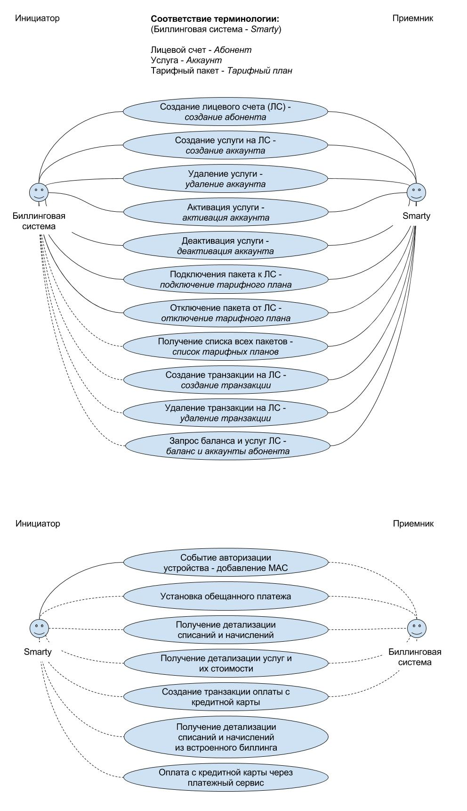

.. _integration:

*****************************************************
5. Интеграция Smarty с внешними системами и сервисами
*****************************************************

.. _tvmiddleware-api:

5.1. Взаимодействие с абонентскими устройствами
===============================================

`Документация по TVMiddleware API <https://microimpuls.github.io/smarty-tvmw-api-docs>`_

.. _billing-api:

5.2. Интеграция с биллингом
===========================

`Документация по Billing API <https://microimpuls.github.io/smarty-billing-api-docs>`_

.. _billing-api-samples:

5.2.1. Примеры кода
-------------------

* Библиотека на Python, реализующая Billing API:
  https://github.com/microimpuls/smarty-billing-api-python
* Скрипт интеграции с биллингом `Гидра <http://www.hydra-billing.ru/>`_:
  https://github.com/microimpuls/admin-tools/tree/master/hydra_billing_script

.. note::

  Смотрите также другие :ref:`дополнительные инструменты <tools-and-scripts>`

.. _billing-integration-scenarios:

5.2.2. Основные варианты взаимодействия с биллинговой системой
--------------------------------------------------------------

Существует три варианта взаимодействия внешней биллинговой системы с сервером smarty:

#. Полный - встроенный биллинг не используется, управлением подписок полностью управляет внешний биллинг.
#. Транзакционный - внешний биллинг создает финансовые транзакции в smarty, управлением подписок занимается встроенный биллинг.
#. Сокращенный - используется какая-либо часть функций из полного варианта.

Также возможно использование только встроенного биллинга - см. :ref:`Встроенный биллинг <builtin-billing>`.

.. _billing-integration-full-mode:

5.2.3. Полный вариант взаимодействия
++++++++++++++++++++++++++++++++++++

* В полном варианте всё управление абонентами и их подписками осуществляется через интерфейс внешней биллинговой системы,
  а произведенные операции синхронизируются с smarty путем отправки команд через :ref:`Billing API <billing-api>`.

* Биллинг осуществляет списание/начисление средств исходя из информации, предоставляемой системой предоставления
  услуг о приобретении/потреблении той или иной услуги, а также осуществляет периодические операции над счетами,
  такие как списание абонентской платы и т.п.

* Список тарифных пакетов формируется на стороне smarty и на стороне внешнего биллинга, производится соответствие идентификаторов
  тарифных пакетов в скрипте интеграции.

* Формирование ценообразования пакетов и услуг происходит на стороне внешнего биллинга.

* Подробная информация об абонентах хранится во внешнем биллинге, в smarty достаточно хранить только лицевые счета и услуги.

* Для целей ведения внутреннего учета на стороне smarty внешний биллинг может создавать транзакции в smarty.

* Для авторизации абонентских устройств может использоваться пара абонемент-пароль, только абонемент, или только UID устройства (например, MAC-адрес).
  В качестве абонемента может выступать лицевой счет.

.. _billing-integration-full-scenarios:

5.2.3.1. Сценарии взаимодействия при полном варианте
....................................................

При реализации полного варианта взаимодействия реализуются все отображенные на рисунке команды от биллинговой системы
к smarty, кроме команд с пунктирной стрелкой (они могут быть реализованы по усмотрению).

Кроме того smarty может дополнительно запрашивать у внешнего биллинга информацию о детализации платежей, начислений,
списке подключенных услуг и их стоимостей, а также проводить обещанный платеж. Эти дополнительные возможности
могут быть реализованы в интерфейсе абонента по усмотрению.

При наличии технической возможности абоненту можно также предоставить возможность проводить оплату сервиса с помощью
кредитной карты из абонентского интерфейса на своем устройстве.

.. _billing-integration-transaction-mode:

5.2.4. Транзакционный вариант взаимодействия
++++++++++++++++++++++++++++++++++++++++++++

* В транзакционном варианте управление абонентами и их подписками осуществляется встроенным биллингом smarty.

* Встроенный биллинг осуществляет списание/начисление средств исходя из команд на создание/удаление транзакций из
  внешнего биллинга, панели администратора, или при ежемесячном автоматическом списании средств с виртуального счета,
  а также пополнения через встроенные средства оплаты.

* Формирование тарифных пакетов и их ценообразования происходит на стороне smarty.

* Подробная информация об абонентах хранится на стороне smarty.

.. _payment-api:

5.3. Платежный шлюз
===================

`Документация по Payment API <http://smarty.microimpuls.com/docs/payment_api/>`_

.. _widgets-api:

5.4. Встраивание модулей в сайт
===============================

`Документация по Site-Widgets API <http://smarty.microimpuls.com/docs/widgets_api/>`_

.. _common-video-servers-integration:

5.5. Интеграция с популярными видео-серверами
=============================================

.. _astra:

5.5.1. Интеграция с Astra
-------------------------

Для интеграции механизма авторизации видеопотоков (стриминг-сервисов) с `Astra <http://cesbo.com>`_ используется механизм генерации
одноразовых токенов для ссылок на поток на стороне сервера Smarty. Astra в момент разбора HTTP Request от
абонентского устройства выделяет токен и проверяет его на сервере Smarty на валидность.

Для генерации токена необходимо в маске URL стриминг-сервиса в Smarty добавить переменную ``$token`` в запрос,
например: ::

  http://streamer.example.com:8080/mychannel/?token=$token

.. note::

  Дополнительная информация:

  * `StreamService API - метод проверки токена StreamServiceTokenCheck <https://microimpuls.github.io/smarty-tvmw-api-docs/#api-StreamService-StreamServiceTokenCheck>`_
  * :ref:`Настройка стриминг-сервисов <smarty-admin-guide-videostreaming-video-services>`

.. _online-vod-services-integration:

5.6. Интеграция с онлайн-кинотеатрами
=====================================

.. _megogo:

5.6.1. Интеграция с Megogo
--------------------------

Smarty содержит модуль для интеграции с онлайн-кинотеатром `Megogo <http://megogo.net>`_, который включает
в себя следующий функционал:

* Синхронизация фильмов и сериалов Megogo со встроенной видеотекой Smarty (наименования, описание, жанры, обложки и т.д.)
* Модель подписки (SVOD)
* Модель покупки отдельных фильмов и сериалов (TVOD)
* Все стандартные функции встроенной видеотеки Smarty (поиск, фильтрация, сортировка, группировка по жанрам и т.д.)
* Прозрачная интеграция в стандартные приложения Microimpuls на разных устройствах - единый интерфейс просмотра ТВ и VOD
  и других сервисов, привычный для абонента

5.6.1.1. Настройка модуля megogo
++++++++++++++++++++++++++++++++

Для подключения интеграции с Megogo необходимо проделать следующие шаги:

* Подключить модуль **megogo** в конфигурации Smarty в секции INSTALLED_APPS, перезагрузить Smarty и выполнить миграцию данных.
* Создать тарифный пакет (например, Megogo) для подписки на фильмы каталога Megogo (SVOD), установить тип тарификации и стоимость.
* В панели администратора в разделе "Общие настройки" -> "Интеграция с API внешних систем" создать новую внешнюю систему:
* * указать название (например, Megogo)
* * выбрать из выпадающего списка класс API ``megogo_api_client``
* * выбрать тарифный пакет, созданный на втором шаге. Абоненты, у которых подключен данный тарифный пакет,
    будут видеть фильмы в видеотеке и иметь возможность их купить (по подписке или транзакционно, в зависимости
    от параметров фильма в Megogo)
* Указать дополнительные аттрибуты внешней системы:
* * ``mobile_private_key`` - закрытый ключ для мобильных устройств (предоставляется Megogo)
* * ``mobile_public_key`` - открытый ключ для мобильных устройств (предоставляется Megogo)
* * ``smart_tv_private_key`` - закрытый ключ для Smart TV (предоставляется Megogo)
* * ``smart_tv_public_key`` - открытый ключ для Smart TV (предоставляется Megogo)
* * ``stb_private_key`` - закрытый ключ для STB (предоставляется Megogo)
* * ``stb_public_key`` - открытый ключ для STB (предоставляется Megogo)
* * ``partner_id`` - идентификатор партнера (предоставляется Megogo)
* * ``salt`` - ключ, используемый для формирования запроса авторизации в биллинге (предоставляется Megogo)
* * ``svod_service_id`` - идентификаторы сервиса SVOD, используемый для оформления услуги пользователю (предоставляется Megogo)
* * ``available_tvod_collection_id`` - идентификатор коллекции для получения доступных TVOD-обьектов (предоставляется Megogo)
* * ``tariff_id`` - идентификатор тарифного пакета, который будет подключен пользователю при активации подписки.
    Подключенность этого пакета означает наличие подписки на соответствующий пакет SVOD в Megogo. При отключении данного
    пакета у абонента/аккаунта в Smarty, будет автоматически вызван метод отписки от SVOD в Megogo.
* Создать требуемые жанры видеотеки и произвести маппинг жанров Megogo к жанрам Smarty в служебной панели администратора
  по адресу http://smarty.example.com/admin/megogo/megogogenremap/.

После выполнения всех шагов необходимо произвести синхронизацию конента с помощью management-команды: ::

    python manage.py megogo_sync_content --settings=settings.<settings filename>

Первая синхронизация может занять около получаса в связи со скачиванием обложек, последующие синхронизации проходят
быстрее. Для регулярной синхронизации фильмов необходимо добавить вызов команды в crontab.

.. note::

    Для возможности покупки фильмов, доступных в TVOD, для каждого ключа должна быть подключена данная услуга на стороне Megogo.

.. _cas_cms:

5.7. Интеграция с CAS CMS
=========================

Smarty поддерживает интеграцию с некоторыми системами CAS по модели единой системы управления подписками, при этом
портальные приложения и клиенты для приставок и других устройств поддерживают работу с любыми CAS, которые поддерживаются
конкретным устройством.

.. _irdeto:

5.7.1. Интеграция с Irdeto
--------------------------

Настройки интеграции задаются в файле конфигурации Smarty:

IRDETO_NATIONALITY ``str``
  Значение по умолчанию: 'RUS'

IRDETO_REGION_TAG ``str``
  Значение по умолчанию: 'MO'

IRDETO_HOST ``str``
  Адрес сервера Irdeto с SOAP API, по умолчанию 'http://127.0.0.1:80'

.. _tools-and-scripts:

5.8. Дополнительные инструменты
===============================

Скрипт миграции данных smarty между БД по client_id
  https://github.com/microimpuls/admin-tools/tree/master/smarty_migrate_tool

Скрипт миграции с OFT Middleware на Microimpuls Middleware
  https://github.com/microimpuls/admin-tools/tree/master/oft_db_migrate_tool

Скрипт миграции аккаунтов и MAC-адресов с Hydra Billing в Microimpuls Middleware
  https://github.com/microimpuls/admin-tools/tree/master/hydra_migrate

Скрипт массового создания аккаунтов через Billing API
  https://github.com/microimpuls/admin-tools/tree/master/mass_customer_creator

.. note::

  Другие полезные скрипты и утилиты см. в репозитории Microimpuls на Github: https://github.com/microimpuls/admin-tools