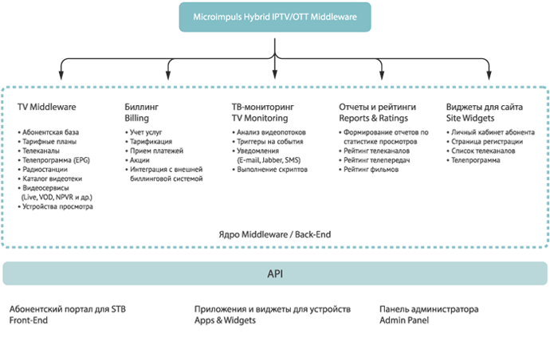
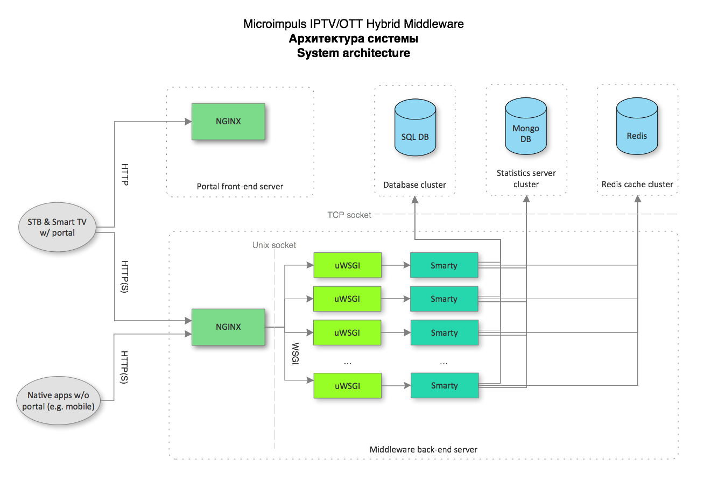

.. _introduction:

********
Описание
********

**Microimpuls Hybrid IPTV/OTT Middleware** — гибкая и многофункциональная система интерактивного телевидения, управляющая
всеми компонентами инфраструктуры, необходимой для работы сервисов OTT и IPTV.

.. _smarty:

**smarty** - серверная часть комплекса Microimpuls IPTV/OTT Middleware, представляет собой Web-приложение на языке Python
с использованием фреймфорка Django. Также содержит административную панель для настройки и управления системой IPTV/OTT
и другими модулями.

.. _smarty-architecture:

Архитектура системы
-------------------

Архитектура системы - клиент-серверная, где сервером (back-end) выступает платформа Middleware,
состоящая из различных модулей и предоставляющая интерфейс API, который используют клиенты (front-end) -
приложения и виджеты для пользовательских устройств (Set-Top Box, Smart TV, мобильные планшеты и телефоны, компьютеры и т.д.).

Абонентское устройство взаимодействует с веб-сервером для загрузки портала (для приложений, использующих портал как
интерфейс пользователя), портал (или нативные приложения на устройствах) взаимодействует с сервером приложений
Middleware через API. Сервер приложений представляет собой связку nginx + uwsgi + подсистемы для хранения данных (СУБД),
хранения данных телесмотрения (MongoDB), кеш-серверы (Redis).

.. _smarty-modules:

Описание модулей
----------------

smarty-base
  Платформа, обязательный модуль. Содержит логику авторизации администраторов, дилеров и виртуальных операторов.

smarty-tvmiddleware
  Модуль IPTV/OTT Middleware. Необходим для сохранения данных и управления каналами, тарифами, абонентами, сервисами
  стриминга и дополнительными видеосервисами (PVR, VoD и другие), а также пользовательскими устройствами.

smarty-billing
  Модуль биллинга. Встроенный биллинг подходит для большинства задач сервиса IPTV/OTT, кроме того содержит API для
  интеграции внешней системы биллинга.

smarty-monitoring
  Модуль мониторинга, содержит API для взаимодействия с анализатором видеопотоков microts и интерфейс для настройки
  просмотра данных мониторинга, подробнее.

smarty-reports
  Модуль отчетов и сбора статистики о просмотрах. Содержит API для сбора данных с пользовательских устройств,
  а также инструменты просмотра рейтинга каналов и телепередач.

smarty-widgets
  Модуль для интеграции с сайтом. Позволяет разместить на любом сайте через Javascript/iFrame виджет такую
  функциональность как личный кабинет, список каналов, страницу регистрации и форму оплаты.

smarty-sms
  Служебный модуль, реализует API некоторых SMS-гейтов.

smarty-ads
  Модуль для поддержки рекламной модели.

smarty-geo
  Модуль для работы механизма геолокации.

.. _system-requirements:

Системные требования
====================

Для работы Microimpuls Middleware требуется 64-битная версия ОС семейства Linux (рекомендуется использовать Debian или
CentOS) с версией Python ветки 2.7.

.. _supported-db:

Поддерживаемые СУБД
-------------------

* SQLite
* MySQL
* Percona XtraDB
* PostgreSQL
* Oracle

Для создания схемы с резервированием данных рекомендуется использовать СУБД с репликацией по схеме Multi Master,
например Percona XtraDB Cluster.

.. _system-requirements-middleware:

Расчет конфигурации сервера Middleware
--------------------------------------

Оптимальная конфигурация на 50000 одновременных пользователей при повышенной интерактивности абонентского приложения
(автоматические обновления информации, быстрый отклик, расширенная программа передач, отправка данных статистики просмотров,
формирование фильтрованных выборок данных и т.д.):
::
    CPU 2x уровня Intel Xeon E5-2620
    64GB DDR3

Максимальная производительность сервера зависит от используемых абонентских приложений и их функций.

Результаты нагрузочного тестирования:
https://github.com/microimpuls/admin-tools/tree/master/smarty_stress_test/results

.. _system-requirements-db:

Расчет конфигурации серверов БД
-------------------------------

Оптимальная конфигурация сервера БД для MySQL/Percona:
::
    CPU 1 x уровня Intel Xeon E3-1230 v3
    32GB DDR3
    2 x 500GB HDD

