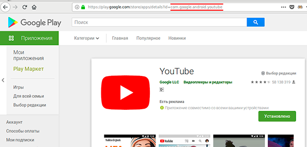

.. _service_configuration:

**************************************
3. Настройка сервиса IPTV/OTT в Smarty
**************************************

Для настройки сервиса доступны две панели администрирования - служебная и основная.
Служебная панель необходима для настройки общих и базовых сущностей, а также редактирования любых объектов.

В основной панели настраивается непосредственно сам сервис IPTV/OTT для конкретного оператора (Client ID).

+-------------------+------------------------------------------------+
| Служебная         | http://smarty.example.com/admin                |
+-------------------+------------------------------------------------+
| Основная          | http://smarty.example.com                      |
+-------------------+------------------------------------------------+

Служебная панель администрирования доступна только для супер-администратора (общий администратор системы).

.. note::

    Домен example.com приведен для примера, используйте свой домен, настроенный в файле конфигурации nginx.

.. _initial-setup:

3.1. Первичная настройка
========================

.. _client-creation:

3.1.1. Добавление Client ID и возможность работы в режиме "Мультипровайдер"
---------------------------------------------------------------------------

.. note::

    Можно пропустить этот шаг, если была выполнена команда :ref:`setup_initial_data <create-setup-initial-data>`

Мультипровайдер - это возможность подключения нескольких проектов или операторов в рамках одной инсталляции системы.
Для каждого проекта при этом будет использоваться независимый набор настроек, абонентская база, параметры устройств,
услуг и т.д.

Для функционирования системы необходимо, чтобы был создан хотя бы один Client ID. Под Client ID подразумевается оператор
услуг или проект оператора.

Создать Client ID необходимо в служебной панели администрирования по ссылке: http://smarty.example.com/admin/clients/client/

Описание полей:

Название
    Название оператора или проекта.

E-Mail
    E-mail для отправки системных сообщений.

Поддомен
    Имя поддомена для настройки порталов, например provider.example.com.

Адрес сайта
    Адрес сайта сервиса.

API key
    Ключ API для подключения абонентских устройств.

Billing API key
    Ключ API для скрипта интеграции с внешним биллингом.

Валюта по умолчанию
    Валюта, которая будет выбрана при оплате услуг абонентом.

Способ оплаты по умолчанию
    Способ оплаты, который будет выбран при оплате услуг абонентом.

Максимально дней пробного просмотра
    Ограничение для запросов к API на создание аккаунтов.

Маска номера договора
    Маска формирования номера договора (см. :ref:`Документы <smarty-admin-guide-billing-documents>`).

Механизм GeoIP
    Используемый механизм геолокации (см. :ref:`Настройка гео-локации <geo-settings>`).

.. _mwportals-and-devices-linking:

3.1.1.1. Привязка абонентского устройства к Client ID
~~~~~~~~~~~~~~~~~~~~~~~~~~~~~~~~~~~~~~~~~~~~~~~~~~~~~

Для привязки приложения абонента к конкретному Client ID используется ключ API (api_key) и client_id.
Эти параметры необходимо прописать в файле настроек client.js при настройке портала, а также при сборке
нативных клиентов под устройства.

API-ключ рекомендуется генерировать через утилиту pwgen с ключом ``-s`` длиной не менее ``64`` символов, например: ::

    pwgen -s 64

.. _playdevice-template-creation:

3.1.2. Добавление шаблонов порталов
-----------------------------------

.. note::

    Можно пропустить этот шаг, если была выполнена команда :ref:`setup_initial_data <create-setup-initial-data>`

В служебной панели администрирования добавить установленные шаблоны порталов:
http://smarty.example.com/admin/tvmiddleware/playdevicetemplate/

Названия (пути) стандартных шаблонов: ``classic`` ``impuls`` ``iridium`` ``focus`` ``futuristic``

.. _playdevice-creation:

3.1.3. Добавление поддерживаемых устройств
------------------------------------------

.. note::

    Можно пропустить этот шаг, если была выполнена команда :ref:`setup_initial_data <create-setup-initial-data>`

В служебной панели администрирования добавить поддерживаемые типы устройств:
http://smarty.example.com/admin/tvmiddleware/playdevice/

Описание полей:

Название
    Название типа устройства.

Системное название
    Системное название типа устройства, возможные значения см. ниже.

Поддерживаемые типы устройств (системные названия): ``android`` ``android_stb`` ``dune`` ``eltex`` ``tvip`` ``lg_netcast``
``lg_webos`` ``mag`` ``pc`` ``sagemcom`` ``samsung_smart_tv`` ``tizen_tv`` ``ios`` ``wrt`` ``amino`` ``imaqliq`` ``kodi``

.. _playdevice-assigning-to-client:

3.1.4. Подключение разрешенных типов устройств для Client ID
------------------------------------------------------------

.. note::

    Можно пропустить этот шаг, если была выполнена команда :ref:`setup_initial_data <create-setup-initial-data>`

В служебной панели администрирования добавить разрешенные типы устройств для каждого Client ID:
http://smarty.example.com/admin/tvmiddleware/clientplaydevice/

.. _epg-setup:

3.1.5. Настройка EPG и иконок телеканалов
-----------------------------------------

В системе существует базовое понятие EPG Channel - это телеканал с прикрепленными иконками и программой передач.
При создании сетки каналов оператора каждому каналу ставится в соответствие один из базовых каналов.
Таким образом, за телеканалами оператора закрепляется иконка и телепрограмма (EPG).

Телепрограмма может быть получена из разных источников, которые настраиваются в служебной панели администрирования:
http://smarty.example.com/admin/tvmiddleware/epgsource/

Описание полей:

Название источника
    Название для отображения.

Имя модуля парсера
    Имя должно соответствовать имени файла с классом парсера в папке ``/tvmiddleware/epg_parsers/``.

Маска URL
    Предоставляется поставщиком EPG.

Существующие парсеры:

+-----------------+---------------------------------------------------------------------------------+
| Имя модуля      | Поставщик EPG                                                                   |
+-----------------+---------------------------------------------------------------------------------+
| dummy_source    | Специальный источник EPG, который генерирует 60-минутные отбивки. Может         |
|                 | использоваться, например, для каналов без EPG или для видеокамер с PVR.         |
|                 | Маска URL: оставить пустым                                                      |
+-----------------+---------------------------------------------------------------------------------+
| yandex          | http://tv.yandex.ru, бесплатный доступ (парсер с сайта).                        |
|                 |                                                                                 |
|                 | Маска URL: оставить пустым                                                      |
+-----------------+---------------------------------------------------------------------------------+
| teleguide       | http://teleguide.info, бесплатный доступ (парсер с сайта).                      |
|                 |                                                                                 |
|                 | Маска URL: оставить пустым                                                      |
+-----------------+---------------------------------------------------------------------------------+
| epgservice      | http://epgservice.ru, платный доступ, формат XMLTV.                             |
|                 |                                                                                 |
|                 | Маска URL:                                                                      |
|                 |                                                                                 |
|                 | http://xmldata.epgservice.ru:8181/EPGService/hs/xmldata/<id>/file/%s            |
|                 |                                                                                 |
|                 | <id> - идентификатор сервиса, предоставляется epgservice                        |
+-----------------+---------------------------------------------------------------------------------+
| xmltv_common    | Универсальный парсер XMLTV.                                                     |
|                 |                                                                                 |
|                 | Маска URL: указать на источник XMLTV                                            |
+-----------------+---------------------------------------------------------------------------------+
| xmltv_from_file | Парсер XMLTV-файлов, основан на xmltv_common.                                   |
|                 |                                                                                 |
|                 | Маска URL: указать путь до файла на сервере Smarty                              |
+-----------------+---------------------------------------------------------------------------------+
| walla           | http://walla.co.il, бесплатный доступ (парсер с сайта).                         |
|                 |                                                                                 |
|                 | Маска URL: оставить пустым                                                      |
+-----------------+---------------------------------------------------------------------------------+
| ucom            | https://www.ucom.am/en/personal/home-services/u-tv/epg (парсер с сайта)         |
|                 |                                                                                 |
|                 | Маска URL: оставить пустым                                                      |
+-----------------+---------------------------------------------------------------------------------+

Настройка EPG-каналов осуществляется в служебной панели администрирования:
http://smarty.example.com/admin/tvmiddleware/epgchannel/

Описание полей:

Название
    Название канала.

URL иконки
    Путь к иконке, абсолютный или относительный, начиная с ``/tvmiddleware/media/``.

Источник EPG
    Имя источника.

ID канала в источнике EPG
    ID канала в сервисе источника.

Номер для сортировки
    Позиция в общем списке, используется для автоматической сортировки оператора.

Сдвиг в часах
    Сдвиг программы в часах относительно UTC+0.

Иконки каналов по умолчанию находятся по адресу ``/tvmiddleware/media/img/logo/default/``.

**Использование иконок нескольких размеров**

Если приложение требует иконки с определенными размерами, то сервер будет выдавать иконки с адресом
``<имя файла><ширина>_<высота>.<расширение>``.
Например, если иконка стандартного размера располагается по адресу
``/tvmiddleware/media/img/logo/default/somelogo.png``, то иконка размера 400x400px - ``/tvmiddleware/media/img/logo/default/somelogo400_400.png``.

Требуемые размеры иконок передаются приложением как аргументы ``icon_width``, ``icon_height`` в запросах :ref:`TVMiddleware API <tvmiddleware-api>`.

.. note::

    Сервер не проверяет существование файла с иконкой, указание неправильных размеров приведет к выдаче URL на несуществующую иконку.

.. _custom-epg-parser:

3.1.5.1. Добавление нового типа парсера
~~~~~~~~~~~~~~~~~~~~~~~~~~~~~~~~~~~~~~~

Для добавления собственного парсера EPG необходимо создать модуль на Python в папке /tvmiddleware/epg_parsers/,
который должен содержать класс EpgParser, наследуемый от EpgParserBase и реализующий все его методы, а затем создать
запись в EPG Source.

.. _manual-epg-editing:

3.1.5.2. Редактирование EPG в ручном режиме
~~~~~~~~~~~~~~~~~~~~~~~~~~~~~~~~~~~~~~~~~~~

Редактирование EPG доступно в служебной панели администрирования по адресу:
http://smarty.example.com/admin/tvmiddleware/epg/

3.1.5.3. Добавление EPG-категорий и EPG-жанров
~~~~~~~~~~~~~~~~~~~~~~~~~~~~~~~~~~~~~~~~~~~~~~

.. note::

    Можно пропустить этот шаг, если была выполнена команда :ref:`setup_initial_data <create-setup-initial-data>`

Для возможности более детальной и удобной фильтрации контента введены понятия EPG-категорий и EPG-жанров - данные
метрики предоставляются поставщиком EPG в составе описания каждой конкретной программы. Таким образом, помимо категории
телеканала, пользователю также доступны категория и жанр любой передачи в отдельности, которые могут не совпадать
с тематикой самого канала.

.. note::
    Именно на основе EPG-категорий и EPG-жанров работает фильтрация передач в экране "TB по интересам".

Добавление EPG-категорий и EPG-жанров осуществляется аналогично, поэтому ниже будет представлено описание этого
процесса для категорий.

1. В первую очередь создаются категории, которые в дальнейшем будут отображаться для абонентов в приложении:
http://smarty.example.com/admin/tvmiddleware/epgcategory/

Описание полей:

Category name
    Название категории.

2. Далее создается "карта отображения" созданных категорий, на те, что предоставляет источник EPG (список данных
категорий запрашивается у поставщика EPG):
http://smarty.example.com/admin/tvmiddleware/epgsourcecategorymap/

Описание полей:

Источник EPG
    Имя источника.

Название категории у источника
    Имя категории в том виде, в котором его отдаёт источник EPG.

Категория EPG
    Имя одного из объектов epgcategory, заранее созданных в панели администратора на шаге 1, либо созданных в процессе.

Шаг 2 необходимо проделать для всех названий категорий, отдаваемых источником.

.. _smarty-admin-guide:

3.2. Руководство по работе в панели администратора
==================================================

.. _smarty-admin-guide-intro:

3.2.1. Общие сведения об административном интерфейсе
----------------------------------------------------

Условно интерфейс можно разделить на две области: панель управления и область данных.

Панель управления имеет следующие элементы:

* Ссылки на разделы настроек — обеспечивает удобную навигацию по интерфейсу.
* Выбор текущего оператора в рамках функции :ref:`Мультипровайдер <client-creation>`.
* Выбор языка — кнопки переключения языка интерфейса (русский и английский).
* Имя пользователя — показывает имя текущего пользователя, а так же позволяет выйти из административного интерфейса, если при нажатии на имя пользователя в открывшемся списке выбрать "Выход".

Область данных может выглядеть по-разному в зависимости от текущего раздела.

.. _smarty-admin-guide-interface-desc:

3.2.2. Описание интерфейса
--------------------------

Все настройки административного интерфейса тематически сгруппированы в меню на панели управления.
При выборе любого пункта выводится список настраиваемых сущностей. Если в списке нет ни одного пункта,
то вместо списка выводится сообщение о том, что они не найдены.

Для списков доступна сортировка, но только по одному столбцу. При этом доступные для сортировки столбцы имеют нижнее
точечное подчеркивание своего наименования.

.. image:: img/admin-guide-sort-columns.png

Чтобы отсортировать список нужно просто нажать на название столбца. Первый клик отсортирует список по возрастанию,
второй — по убыванию, дальнейшие клики будут чередовать эти два способа сортировки. При этом сортировка по возрастанию
обозначается стрелкой вверх рядом с наименованием столбца, а сортировка по убыванию — стрелкой вниз.

.. image:: img/admin-guide-sort-asc.png

Для некоторых данных используется специальная колонка *Порядок сортировки*.
Она сортирует элементы не только в административном интерфейсе, но и определяет порядок отображения элементов
в интерфейсе на устройстве абонентов. В этой колонке каждому элементу списка соответствует свой значок стрелки.
В зависимости от того, вверх или вниз направлена стрелка, при нажатии на нее элемент уйдет вверх или вниз по списку
соответственно.

.. image:: img/admin-guide-sort-field.png

Если список элементов большой, то он разбивается на страницы. На одной странице обычно размещается 25 записей,
но можно выбрать другое значение — 10, 50, 100 или 250, за эту функцию отвечает раскрывающийся список внизу страницы.

.. image:: img/admin-guide-number-of-rows.png

При выборе нового значения текущая страница обновляется, и в зависимости от получившегося количества страниц,
отображается либо та же по счету страница, на которой была произведена смена значений, либо первая ближайшая к ней.
Навигация между страницами осуществляется с помощью навигационной панели с номерами страниц. На панели располагается
10 кнопок с номерами страниц, остальные кнопки позволяют перемещаться между страницами. Так кнопки **<** и **>**
ведут на предыдущую и следующую страницы соответственно. А кнопки **<<** и **>>** загружают первую и последнюю страницы
соответственно.

.. image:: img/admin-guide-pagination.png

Почти во всех разделах доступен поиск или фильтрация данных.

.. image:: img/admin-guide-search.png

Для возврата от результатов поиска к полному списку служит кнопка **Сбросить**.

Практически для всех настроек доступно добавление/удаление пунктов. Эту функцию обеспечивают кнопки **Добавить**,
**Изменить** и **Удалить выбранные** над списком.

.. image:: img/admin-guide-manage-buttons.png

При этом кнопки **Изменить** и **Удалить выбранные** становятся активными, только после выбора хотя бы одного пункта
списка.

Для удаления сущности достаточно нажать на кнопку **Удалить выбранные**.
После нажатия кнопки **Изменить** открывается страница редактирования, где можно менять значения параметров.

.. image:: img/admin-guide-edit-form.png

Кнопка **Сохранить изменения** сохраняет внесенные правки. Кнопка **Вернуться к списку** не сохраняя внесенных правок,
просто перемещает пользователя к списку настраиваемых сущностей.

В некоторых разделах доступна сводная статистика активности, например в аккаунтах абонентов.

.. image:: img/admin-guide-active-status.png

Синим цветом в таких таблицах обозначается общее количество записей. Зеленым обозначается количество записей, у которых
в настройках выбрано: *Активен* или *Включен*, либо их статус *Online*, соответственно красный цвет — количество
записей, у которых не включены значения *Активен* или *Включен*. Серый цвет — количество записей со статусом *Offline*.

.. _smarty-admin-guide-index:

3.2.3. Обзор основных разделов
------------------------------

Панель администора позволяет управлять настройками таких компонентов как:

* Абонентская база
* Тарифные пакеты и набор услуг
* Телеканалы
* Телепрограмма (EPG)
* Радиостанции
* Каталог видеотеки
* Каталог приложений
* Стриминг-сервисы (Live, VOD, PVR и др.)
* Устройства

Для удобства настройки сгруппированы в меню на главной панели и разделены на категории:

* Общие настройки
* Видео-серверы
* Мониторинг
* Настройки стриминга
* Биллинг
* Настройки контента
* Абоненты
* Отчеты

Чтобы начать работать с настройками следует выбрать необходимый пункт в выпадающем списке интересующей категории.
Каждая настройка представляет собой список, элементы которого можно добавлять/удалять, а так же менять значения их параметров, что позволяет
настраивать различные компоненты.

.. _smarty-admin-guide-main:

3.2.4. Раздел: Общие настройки
------------------------------

.. _smarty-admin-guide-main-device-configuration:

3.2.4.1. Настройки STB и приложений
~~~~~~~~~~~~~~~~~~~~~~~~~~~~~~~~~~~

Этот раздел содержит список устройств для просмотра сервиса IPTV (приставки Set-Top Box, Smart TV, мобильные устройства,
компьютер и др.), которые поддерживаются оператором
(см. :ref:`Подключение разрешенных оператору типов устройств<playdevice-assigning-to-client>`).

Здесь указываются базовые настройки для взаимодействия устройств с сервисом.

Для редактирования настроек устройства можно использовать кнопку **Настройки**, либо нажать на название устройства.

.. _smarty-admin-guide-main-site-widgets:

3.2.4.2. Виджеты для интеграции с сайтом
~~~~~~~~~~~~~~~~~~~~~~~~~~~~~~~~~~~~~~~~

В этом разделе настраиваются виджеты для интеграции сайта с сервисом IPTV. Подробнее о механизме
:ref:`встраивания модулей в сайт <widgets-api>`.

Доступны следующие типы виджетов:

* *Channel list* - список телеканалов с группировкой по тарифным пакетам и возможностью поиска.
* *Registration* - страница регистрации с помощью e-mail и СМС.
* *Account page* - личный кабинет абонента, из которого доступно подключение/отключение тарифных пакетов, оплата, редактирования профиля и др.
* *EPG program* - телепрограмма на все подключенные телеканалы.

.. _smarty-admin-guide-main-user-access:

3.2.4.3. Настройка прав пользователей
~~~~~~~~~~~~~~~~~~~~~~~~~~~~~~~~~~~~~

В этом разделе администратору доступно редактирование прав других администраторов или модераторов сервиса
для ограничения их доступа к тем или иным разделам или функциональности.

Добавление новых пользователей производится в служебной панели администрирования по ссылке:
http://smarty.example.com/admin/users/user/.

Права доступа разделены по группам согласно категориям разделов в панели администратора. Детальные права на
выполнение тех или иных действий с данными состоят из:

* *Can view ...* - имеет доступ к просмотру информации
* *Can create ...* - имеет доступ к созданию элементов
* *Can edit ...* - имеет доступ к редактированию
* *Can delete ...* - имеет доступ к удалению

.. _smarty-admin-guide-videostreaming:

3.2.5. Раздел: Настройки стриминга
----------------------------------

.. _smarty-admin-guide-videostreaming-data-centers:

3.2.5.1. Дата-центры
~~~~~~~~~~~~~~~~~~~~

Под дата-центром подразумевается либо физический узел размещения группы серверов, либо виртуальная группа
стриминг-сервисов. Используется для объединения сервисов и дальнейшей маршрутизации на основании предпочтительного
географического либо иного отношения аккаунтов к тем или иным сервисам.

.. _smarty-admin-guide-videostreaming-video-services:

3.2.5.2. Стриминг-сервисы
~~~~~~~~~~~~~~~~~~~~~~~~~

Стриминг-сервисы представляют собой серверы, осуществляющие вещание и обработку видеопотоков.
Набор настроек различается в зависимости от типа выбранного стриминг-сервиса, однако параметры в блоках
*Основные параметры* являются общими для всех.

3.2.5.2.1. Динамическая и статическая маршрутизация
+++++++++++++++++++++++++++++++++++++++++++++++++++

Если для телеканала, фильма или другой единицы контента заданы активные стриминг-сервисы и не задан прямой URI потока, то
будет использована динамическая маршрутизация. В момент обращения абонентской приставки к соответствующему контенту
осуществляется поиск одного из подключенных стриминг-сервисов на основании типа контента, подключенных тарифных пакетов,
а также доступности и нагруженности сервиса. Затем, исходя из настроек стриминг-сервиса, формируется URL контента, по
маске либо после вычисления скрипта.

При статической маршрутизации URL контента генерируется при формировании плейлиста. Такой тип маршрутизации может
быть использован для потоков без авторизации, Multicast-потоков для IPTV, либо внешних Unicast-потоков партнеров.

3.2.5.2.2. Динамическая маршрутизация, задаваемая скриптом
++++++++++++++++++++++++++++++++++++++++++++++++++++++++++

Скрипт позволяет создать нестандартную логику маршрутизации. Используемый язык - Python. В результате работы скрипта
должна быть определена переменная ``uri``, содержащая URL видеопотока.

Пример скрипта:
::
    def get_random_proxy(datacenter):
        if datacenter == 4:
            proxies = [
                {
                    'ip': '1.1.1.1', 'port': 8181,
                    'key': 'DrRSwkrMudmsYb0K'
                },
                {
                    'ip': '2.2.2.2', 'port': 8181,
                    'key': 'DrRSwkrMudmsYb0K'
                },
                {
                    'ip': '3.3.3.3', 'port': 8181,
                    'key': 'DrRSwkrMudmsYb0K'
                }
            ]
        else:
            return 0
        return random.choice(proxies)

    uri = 'http://1.2.3.4:8080/%s/?s=DeZcC2A0OkjLwlBb' % prefix

    proxy = get_random_proxy(adid)
    if proxy:
        uri = 'http://%s:%d/%s/%s' % (proxy['ip'], proxy['port'], proxy['key'], uri.replace('http://', ''))

Выше приведен пример скрипта, в котором URL видеопотока задается сначала по маске, а затем, если у аккаунта
задан определенный дата-центр (id = 4 в примере), то для него случайным образом выбирается один из прокси-серверов,
после чего URL заменяется на прокси.

.. _smarty-admin-guide-videostreaming-maintenance:

3.2.5.3. Технические работы
~~~~~~~~~~~~~~~~~~~~~~~~~~~

Технические работы используются для частичного ограничения доступа к сервису когда это необходимо.
Например, в заданный временной период, пока проводятся технические работы либо произошла авария, абонентам может быть
недоступен просмотр записанных программ.

.. _smarty-admin-guide-billing:

3.2.6. Раздел: Биллинг
----------------------

.. _smarty-admin-guide-billing-tariffs:

3.2.6.1. Тарифные пакеты
~~~~~~~~~~~~~~~~~~~~~~~~

Раздел позволяет управлять списком тарифных пакетов и их настройками.
См. :ref:`Возможности тарификации <billing-tariffs-features>`.

.. _smarty-admin-guide-billing-transactions:

3.2.6.3. Финансовые операции
~~~~~~~~~~~~~~~~~~~~~~~~~~~~

Раздел содержит информацию о движении денежных средств по аккаунтам абонентов.

Данные могут добавляться как вручную, так и автоматически в случае использования биллинга
(см. :ref:`Сценарии взаимодействия с биллинговой системой <billing-integration-scenarios>`).
Если используется внешняя система биллинга, то для получения списка транзакций в этом разделе необходима синхронизация
через :ref:`Billing API <billing-api>`.

Поиск здесь представляет собой фильтр, как по одному параметру, так и по нескольким сразу:

.. image:: img/admin-guide-transactions-filter.png

Также доступен экспорт отчета по транзакциям в файл CSV:

.. image:: img/admin-guide-transactions-export.png

.. _smarty-admin-guide-services:

3.2.7. Раздел: Настройки контента
---------------------------------

.. _smarty-admin-guide-services-categories:

3.2.7.1. Категории ТВ
~~~~~~~~~~~~~~~~~~~~~

В этом разделе добавляются категории телеканалов. Каждый телеканал должен обязательно относится к той или иной категории.
В абонентском приложении, в зависимости от шаблона, но как правило, присутствует возможность отображения телеканалов
определенной категории для упрощения поиска нужного контента.

.. _smarty-admin-guide-services-channels:

3.2.7.2. Каналы
~~~~~~~~~~~~~~~

Это один из основных разделов для настройки сервиса IPTV/OTT. Здесь производится настройка списка телеканалов,
которые вещает оператор, а также конфигурация их вещания и отображения.

Кроме ручного выставления порядка каналов с помощью поля *Порядок сортировки* списку телеканалов можно автоматически
задать сортировку, которая будет использоваться на устройствах пользователей, используя методы из списка
**Авто-сортировка**, который расположен выше остальных кнопок управления:

Автоматически
    Сортировка осуществляется по номерам кнопок каналов, которые задаются в поле *Номер для сортировки* при настройке
    EPG-каналов, см. :ref:`Настройка EPG <epg-setup>`. При использовании Microimpuls Middleware как платформы от
    ООО "Майкроимпульс" в рамках услуги "Виртуальный оператор" данный метод отсортирует каналы согласно заключенным
    лицензионным договорам между ООО "Майкроимпульс" и правообладателями и действующему законодательству.

По ID
    При добавлении канала в список ему присваивается ID, данная сортировка происходит по этому параметру.

По названию
    Сортировка осуществляется по наименованию канала.

Пользовательская сортировка
    Если была применена одна из предыдущих сортировок, выбор этого пункта вернет к первоначальной ручной сортировке
    оператора.

.. _smarty-admin-guide-services-epg:

3.2.7.3. Телепрограмма
~~~~~~~~~~~~~~~~~~~~~~

Раздел позволяет просматривать EPG для всех каналов, а также очищать и принудительно переимпортировать EPG для
отдельных каналов.

Выбор канала осуществляется в левом меню. Для очистки телепрограммы необходимо нажать кнопку **Очистить EPG**, для
импортирования - **Принудительно импортировать EPG**.

.. note::

    Автоматический импорт настраивается через планировщик,
    см. :ref:`Настройка выполнения команд в crontab <crontab-settings>`.

    Расширенное редактирование EPG доступно в служебной панели администратора,
    см. :ref:`Редактирование EPG в ручном режиме <manual-epg-editing>`.

.. _smarty-admin-guide-services-genres:

3.2.7.4. Жанры и категории VOD
~~~~~~~~~~~~~~~~~~~~~~~~~~~~~~

В этом разделе можно добавлять/удалять и редактировать жанры для фильмов, предоставляемых по услуге Video-On-Demand.

Жанры отображаются в пользовательском интерфейсе на абонентских устройствах, при выборе пункта меню,
соответствующего данной услуге. Так же для определения порядка, в котором жанры выводятся на устройстве
абонента, используется колонка *Порядок сортировки*.

.. _smarty-admin-guide-services-videos:

3.2.7.5. Фильмы
~~~~~~~~~~~~~~~

В этом разделе осуществляется управление каталогом фильмов и видео-файлов.

В списке фильмов есть кнопка **Assets**, при нажатии на которую будет открыт
раздел редактирования ассетов (файлов), относящихся к данному видео. У одного видео может быть несколько ассетов, выбор конкретного
ассета для воспроизведения доступен абоненту при просмотре информации о фильме на своем устройстве.

Обратите внимание, что для того чтобы вернуться к изначальному списку ассетов видеотеки, следует нажать кнопку
**Вернуться к списку**, которая расположена над списком.

.. _smarty-admin-guide-services-radios:

3.2.7.6. Радиостанции
~~~~~~~~~~~~~~~~~~~~~

В этом разделе осуществляется редактирование списка радиостанций.

.. _smarty-admin-guide-services-ads:

3.2.7.7. Рекламные ролики
~~~~~~~~~~~~~~~~~~~~~~~~~

В этом разделе добавляются рекламные ролики, которые затем могут быть сформированы в *Рекламные блоки* (см. далее).

.. note::

    Поддержка данного функционала возможна не на всех устройствах и её реализация зависит от абонентского приложения.

.. _smarty-admin-guide-services-ad-blocks:

3.2.7.8. Рекламные блоки
~~~~~~~~~~~~~~~~~~~~~~~~

В этом разделе добавляются рекламные блоки, состоящие из последовательности роликов.

.. _smarty-admin-guide-services-apps:

3.2.7.9. Каталог приложений
~~~~~~~~~~~~~~~~~~~~~~~~~~~

В данном разделе производится управление каталогом внешних приложений, доступных на абонентском устройстве в портале,
кроме основного сервиса IPTV. Внешним приложение может быть, например, плеер Youtube, онлайн-чат, служба прогноза погоды
или пробок, игры и другие сервисы. Приложение представляет собой Web-страницу на Javascript.

Типы приложений:

* Web-приложение во внешнем окне - любой URL, открывающийся в браузере устройства. Особенность данного вида приложения заключается в том, что не на всех устройствах после его открытия можно вернуться обратно в родительское приложение.

* Web-приложение во внутреннем окне - данный тип приложения используется для собственных виджетов оператора, написанных специально для абонентского портала Justify. Для разработки такого приложения можно воспользоваться документацией: http://mi-justify-dev-docs.readthedocs.io/

* Ссылка на раздел видеотеки - при создании данного типа виджета в приложении появится ещё одна ссылка на открытие видеотеки (в главном меню или в списке сервисов, в зависимости от настройки виджета).

* Воспроизведение потока по ссылке - воспроизведение любого потока по ссылке, указанной в поле "URL / Название / ID приложения".

* Виджет - в приложение будет добавлен внутренний виджет, разработанный специально для шаблона. На текущий момент виджеты доступны только для шаблона futuristic:
* Прогноз погоды *
   Системное название: WeatherWidget
   url: /templates/futuristic/default/apps/weather-widget/weather.widget.js
   Атрибуты:
    * city__NUM__name: название города
    * city__NUM__id: идентификатор города в источнике, заданном в конфиге Smarty
* Курс валют *
   Системное название: ExchangeWidget
   url: /templates/futuristic/default/apps/exchange-widget/exchange.widget.js
* Телеканал *
   Системное название: TVChannelWidget
   url: /templates/futuristic/default/apps/tvchannel-widget/tvchannel.widget.js
   Атрибуты:
    * number: номер канала по порядку в Smarty
* Баннер *
   Системное название: PromoImageWidget
   url: /templates/futuristic/default/apps/promo-image-widget/promo.image.widget.js
   Атрибуты:
    * image_url: адрес превью-картинки баннера
    * big_image_url: адрес полноэкранной картинки баннера
    * refresh_interval: интервал для обновления картинки с сервера (в секундах)
* Новости *
   Системное название: NewsWidget
   url: /templates/futuristic/default/apps/news-widget/news.widget.js
   Атрибуты:
    * rss_url: адрес RSS-ленты
* Баннер-ссылка *
   Системное название: LinkImageWidget
   url: /templates/futuristic/default/apps/link-image-widget/link.image.widget.js
   Атрибуты:
    * image_url: адрес превью-картинки баннера
    * link_url: адрес ссылки, открывающийся при запуске виджета
* Поиск *
   Системное название: SearchWidget
   url: /templates/futuristic/default/apps/search-widget/search.widget.js
* Промо фильма *
   Системное название: PromoVodWidget
   url: /templates/futuristic/default/apps/promo-vod-widget/promo.vod.widget.js
   Атрибуты:
    * items__NUM__id: идентификатор фильма/подписки в Smarty
    * items__NUM__content_type: тип контента, значения: 0 - фильм, 1 - подписка
    * items__NUM__content_name: название контента
    * items__NUM__trailer_url: url трейлера
    * items__NUM__preview_url: url превью-картинки
* Промо канала *
   Системное название: PromoStreamWidget
   url: /templates/futuristic/default/apps/promo-stream-widget/promo.stream.widget.js
   Атрибуты:
    * items__NUM__trailer_url: url трейлера
    * items__NUM__preview_url: url превью-картинки

* Экран настроек Android - виджет, который при запуске открывает системные настройки Android

* Меню приложений Android - виджет, который при запуске открывает системное меню приложений Android

* Запуск приложения Android по AppId - виджет, открывающий заданное системное или установленное приложение Android. Для данного виджета в поле "URL / Название / ID приложения" задается системное имя приложения, которое можно узнать несколькими способами:
    * на некоторых версиях Android его можно узнать, открыв: Настройки -> Приложения -> Интересующее приложение
    * если приложение было скачано из Google Play, идентификатор можно посмотреть в строке браузера:

    * если оба способа выше не подходят/не помогли, то можно установить специальное приложение Package Name Viewer, благодаря которому появится возможность просмотреть идентификатор всех установленных приложений.

* Ссылка на раздел ТВ - при создании данного типа виджета в приложении появится ещё одна ссылка на открытие меню ТВ (в главном меню или в списке сервисов, в зависимости от настройки виджета).

* Запуск системного приложения по ID - аналог виджета "Запуск приложения Android по AppId", но предназначенный для других устройств с возможностью запуска внешних приложений. На данный момент такая возможность доступна на приставках Tvip (идентификаторы приложений можно посмотреть в официальной документации Tvip https://wiki.tvip.ru/stb/system_uri )

.. _smarty-admin-guide-customers:

3.2.8. Раздел: Абоненты
-----------------------

.. _smarty-admin-guide-customers-customers:

3.2.8.1. Абоненты
~~~~~~~~~~~~~~~~~

В данном разделе производится заведение абонентов. В списке абонентов есть три специальные колонки:
*Аккаунты*, *Платежи* и *Сообщения* - они содержат ссылки на соответствующие связанные с абонентом разделы.

При нажатии на имя абонента открывается карточка абонента и страница редактирования его параметров.

.. _smarty-admin-guide-customers-accounts:

3.2.8.2. Аккаунты
~~~~~~~~~~~~~~~~~

В этом разделе производится заведение аккаунтов абонентов. При нажатии на номер аккаунта открывается карточка аккаунта,
где также доступно редактирование его параметров.

.. _smarty-admin-guide-customers-devices:

3.2.8.3. Устройства
~~~~~~~~~~~~~~~~~~~

В этом разделе отображается список зарегистрированных устройств абонентов. Информация об устройствах добавляется
в систему автоматически, при первом подключении абонента, но также допускается и ручное добавление устройств.

.. _smarty-admin-guide-customers-messages:

3.2.8.4. Сообщения
~~~~~~~~~~~~~~~~~~

В этом разделе можно создавать информационные рассылки на устройства абонентов. Такие сообщения могут быть добавлены
как вручную из интерфейса личного кабинета, так и добавляются системой автоматически, например при поступлении платежа
из личного кабинета, или подключении/отключении тарифного пакета, или при приближающейся дате окончания подписки.

.. note::
    В большинстве абонентских приложений Microimpuls входящие сообщения реализованы как всплывающие окна.

.. warning::
    Мобильные и нативные приложения могут не поддерживать HTML-форматирование.

.. _smarty-admin-guide-customers-messages-mass-mailing:

3.2.8.4.1. Массовая рассылка сообщений
++++++++++++++++++++++++++++++++++++++

Инструмент **Массовая рассылка** позволяет сформировать рассылку сообщений группе абонентов, которую можно выбрать
по нескольким критериям:

* Период последней активности аккаунтов - позволяет выбрать абонентов, которые использовали сервис в определенный
  период.
* Тарифные пакеты - позволяет выбрать тарифные пакеты, в этом случае в выборку попадут абоненты, которым подключены
  выбранные тарифные пакеты.

При использовании массовой рассылки в теме и тексте сообщения можно использовать переменные, которые будут автоматически
заменены на значения в момент создания сообщения: ``$firstname`` - имя абонента, ``$lastname`` - фамилия абонента.

.. _smarty-admin-guide-customers-dealers:

3.2.8.5. Дилеры
~~~~~~~~~~~~~~~

Дилеры — это партнеры, которые могут предоставлять услуги и взаимодействовать с абонентами от имени оператора.
В этом разделе указывается информация о дилерах, набор полей и структура раздела схожа со страницей
:ref:`Абоненты <smarty-admin-guide-customers-customers>`.

Отдельно стоить обратить внимание на поля *Имя пользователя* и *Пароль* - эти данные нужны для создания учетной записи
дилера в панели администрирования Smarty. Такая учетная запись имеет ограниченные права и не имеет доступа к некоторым
возможностям, однако позволяет создавать абонентов и аккаунтов, таким образом подключая их к сервису.

Созданные абоненты и аккаунты автоматически привязываются к дилеру.

.. _billing-general-points:

3.3. Общие особенности работы с услугами и аккаунтами в Smarty
==============================================================

.. _billing-tariffs-features:

3.3.1. Возможности тарификации
------------------------------

Тарифный пакет представляет собой группу объединенных в него услуг, например телеканалов, интерактивных функций,
фильмов и т.д.

Набор подключенных тарифных пакетов у абонента и аккаунта определяет набор доступных для него услуг,
при этом возможно пересечение услуг в разных тарифных пакетах.

Тарифный пакет может не содержать ни одной услуг, однако обладать определенными опциями и разрешениями,
в таком случае тарифный пакет считается тарифной опцией.

.. _billing-tariffs-types:

3.3.2. Типы тарифных пакетов
----------------------------

1. Помесячная оплата - тарифный пакет рассчитывается биллингом в рамках ежемесячной подписки.

2. Ежегодная оплата - во встроенном биллинге не реализовано.

3. Скрытый - тарифный пакет не участвует в расчетах и невидим для абонента.

.. _billing-multiabonement:

3.3.3. Мультиабонемент
----------------------

Мультиабонемент - это возможность использовать единый аккаунт на нескольких устройствах. Smarty позволяет гибко
настроить возможности мультиабонемента для разного типа устройств - базовых (например, Multicast-устройства)
и дополнительных (например, Unicast-устройства). Тип устройства (базовое или дополнительное) задается произвольно
каждым оператором в настройках устройств в панели администратора (раздел "Общие настройки").

Ограничения мультиабонемента настраиваются в параметрах тарифного пакета.
Если у абонента/аккаунта подключено несколько тарифных пакетов, то соответствующее ограничение определяется как
максимальное значение из всех подключенных пакетов.

*Максимальное количество базовых устройств* - это ограничение действует на максимальное количество привязанных к
аккаунту базовых устройств, имеющих сессию авторизации в Smarty (не обязательно online).
На запрос авторизации с базового устройства сверх лимита сервером будет возвращен запрет авторизации (код 5).

*Максимальное количество одновременных сессий дополнительных устройств* - это ограничение работает по принципу
"карусели" и действует на количество одновременных (online) сессий аккаунта с дополнительных устройств.
Авторизация с дополнительного устройства сверх лимита разрешена, однако в этом случае самая старая сессия аккаунта
будет деавторизована.

Дополнительно существует возможность включить проверку на IP-адрес, с которых авторизованы одновременно используемые
дополнительные устройства. Если проверка включена, то при авторизации нового дополнительного устройства с другого
IP-адреса, все устройства с предыдущего IP-адреса будут деавторизованы.

.. _billing-basic-tariff:

3.3.4. Признак базового тарифа
------------------------------

Поле *"Признак базового тарифа"* означает принадлежность тарифа к Базовому и его вес среди них.
Например, может быть создано несколько базовых тарифов, при этом тариф с наибольшим приоритетом будет устанавливаться абонентам по умолчанию.

Абонент может выбрать только один из базовых тарифов при регистрации и в личном кабинете.

Тариф, не являющийся базовым, считается дополнительным.
Дополнительные тарифы могут быть подключены только дополнительно к одному из базовых, и не могут быть подключены отдельно от него.

.. _billing-debtors-tariffs:

3.3.5. Доступность тарифа для неактивных аккаунтов
--------------------------------------------------

Специальная опция тарифа *"доступен для неактивных аккаунтов"* позволяет создать тарифные пакеты с набором бесплатных услуг,
доступных абонентам, которые были отключены по причине неоплаты, или другой причине.

Таким образом, можно создать набор телеканалов или дополнительных сервисов, которые будут доступны неактивным абонентам.

Для аккаунтов, у абонентов которых есть подключенные тарифные пакеты с такой опцией,
разрешается авторизация в системе даже будучи неактивными, однако им выдается ограниченный данными тарифными пакетами набор услуг.

Это может быть использовано, например, для бесплатной трансляции каналов 1 и 2 мультиплекса.

.. _builtin-billing:

3.4. Выбор модели работы с внешней или встроенной биллинговой системой
======================================================================

3.4.1. Описание режимов работы биллинга
---------------------------------------

.. _billing-activation-deactivation-dates-mode:

3.4.1.A. Встроенный биллинг по датам активации и деактивации (предоплатная модель)
~~~~~~~~~~~~~~~~~~~~~~~~~~~~~~~~~~~~~~~~~~~~~~~~~~~~~~~~~~~~~~~~~~~~~~~~~~~~~~~~~~

Для каждого аккаунта может быть задана дата активации и дата деактивации. Когда наступает дата активации
аккаунт автоматически активируется и может быть авторизован в системе и получить доступ к просмотру.
Когда наступает дата деактивации, аккаунт деактивируется. Биллинг самостоятельно не устанавливает эти даты,
поэтому такой вариант биллинга является ручным или полуавтоматическим.

Варианты использования:

1. Даты устанавливаются администратором / оператором абонентского отдела
2. Даты устанавливаются внешней биллинговой системой через :ref:`Billing API <billing-api>`
3. Для предоставления первичного доступа к сервису после регистрации, или раздачи тестовых аккаунтов.
   В таком случае используется специальное поле *"количество дней активации"*, которое предустанавливается для нового аккаунта.
   Если это поле задано, то после первой авторизации такого аккаунта (разрешается авторизоваться неактивным аккаунтом)
   он сразу активируется, при этом устанавливается дата активации (текущая дата) и дата деактивации (дата активации + число дней тестового доступа).
   Затем по наступлении даты деактивации аккаунт отключается, как описано выше.

.. _billing-auto-mode:

3.4.1.B. Встроенный биллинг: автоматический (предоплатная модель)
~~~~~~~~~~~~~~~~~~~~~~~~~~~~~~~~~~~~~~~~~~~~~~~~~~~~~~~~~~~~~~~~~

1. Ежемесячная подписка.
   Логика работы повторяет режим I, кроме следующих исключений:
   а) в момент наступления даты деактивации происходит попытка списания средств и продления аккаунта, а также устанавливается дата продления, равная текущей дате;
   б) если наступает дата, равная дате последнего продления + календарный месяц, то происходит попытка списания средств и продления аккаунта.
2. Ежегодная подписка - не реализовано во встроенном биллинге, требуется использование внешнего биллинга.
3. Другое (система скидок, платежи за несколько месяцев) - не реализовано во встроенном биллинге, требуется использование внешнего биллинга.

.. _billing-charging-mechanism:

3.4.1.B.1. Механизм списания средств и продления
++++++++++++++++++++++++++++++++++++++++++++++++

Если на счете абонента есть необходимая сумма денег для оплаты всех подключенных тарифных пакетов и опций на очередной месяц,
то происходит списание этих средств и аккаунт не деактивируется.
Устанавливается дата продления, равная текущей дате (необходима для расчета следующего списания).

Если средств недостаточно, то аккаунт деактивируется.
В момент списания средств создается транзакция с отрицательной суммой операции.

.. _billing-payment-mechanism:

3.4.1.B.2. Механизм оплаты
++++++++++++++++++++++++++

Оплата возможна через ручное создание транзакции в биллинге, через внешний биллинг,
через оплату в личном кабинете (оплата разными способами через шлюз WalletOne, оплата кредитной картой, Paypal).
После подтверждения транзакции если аккаунт абонента неактивен, то происходит попытка списания средств и продления аккаунта,
а если он активен - то простое зачисления средств на личный счет в системе.
В момент оплаты создается транзакция с положительной суммой операции.

.. _billing-disabled-mode:

3.4.1.C. Встроенный биллинг отключен, использование внешнего биллинга
~~~~~~~~~~~~~~~~~~~~~~~~~~~~~~~~~~~~~~~~~~~~~~~~~~~~~~~~~~~~~~~~~~~~~

Если не установлена ни дата активации, ни дата деактивации, ни дата продления (не используется ни режим A, ни B),
то биллинг для аккаунта считается отключенным.
Такой аккаунт может быть постоянно активированным, или управляться внешней биллинговой системой без задействования встроенного биллинга.
См. :ref:`Варианты взаимодействия с внешней биллинговой системой <billing-integration-scenarios>`.

