.. _service_configuration:

**************************************
3. Настройка сервиса IPTV/OTT в Smarty
**************************************

Для настройки сервиса доступны две панели администрирования - служебная и основная.
Служебная панель необходима для настройки общих и базовых сущностей, а также редактирования любых объектов.

В основной панели настраивается непосредственно сам сервис IPTV/OTT для конкретного оператора (Client ID).

+-------------------+------------------------------------------------+
| Служебная         | http://smarty.example.com/admin                |
+-------------------+------------------------------------------------+
| Основная          | http://smarty.example.com                      |
+-------------------+------------------------------------------------+

Служебная панель администрирования доступна только для супер-администратора (общий администратор системы).

.. note::

    Домен example.com приведен для примера, используйте свой домен, настроенный в файле конфигурации nginx.

.. _initial-setup:

3.1. Первичная настройка
========================

.. _client-creation:

3.1.1. Добавление Client ID и возможность работы в режиме "Мультипровайдер"
---------------------------------------------------------------------------

Мультипровайдер - это возможность подключения нескольких проектов или операторов в рамках одной инсталляции системы.
Для каждого проекта при этом будет использоваться независимый набор настроек, абонентская база, параметры устройств,
услуг и т.д.

Для функционирования системы необходимо, чтобы был создан хотя бы один Client ID. Под Client ID подразумевается оператор
услуг или проект оператора.

Создать Client ID необходимо в служебной панели администрирования по ссылке: http://smarty.example.com/admin/client/

Описание полей:

Название
    Название оператора или проекта.

E-Mail
    E-mail для отправки системных сообщений.

Поддомен
    Имя поддомена для настройки порталов, например provider.example.com.

Адрес сайта
    Адрес сайта сервиса.

API key
    Ключ API для подключения абонентских устройств.

Billing API key
    Ключ API для скрипта интеграции с внешним биллингом.

Валюта по умолчанию
    Валюта, которая будет выбрана при оплате услуг абонентом.

Способ оплаты по умолчанию
    Способ оплаты, который будет выбран при оплате услуг абонентом.

Максимально дней пробного просмотра
    Ограничение для запросов к API на создание аккаунтов.

Маска номера договора
    Маска формирования номера договора (см. :ref:`Документы <smarty-admin-guide-billing-documents>`).

Маска номера счета
    Маска формирования номера счета (см. :ref:`Документы <smarty-admin-guide-billing-documents>`).

Механизм GeoIP
    Используемый механизм геолокации (см. :ref:`Настройка гео-локации <geo-settings>`).

.. _mwportals-and-devices-linking:

3.1.1.1. Привязка абонентского устройства к Client ID
~~~~~~~~~~~~~~~~~~~~~~~~~~~~~~~~~~~~~~~~~~~~~~~~~~~~~

Для привязки приложения абонента к конкретному Client ID используется ключ API (api_key) и client_id.
Эти параметры необходимо прописать в файле настроек client.js при настройке портала, а также при сборке
нативных клиентов под устройства.

API-ключ рекомендуется генерировать через утилиту pwgen с ключом ``-s`` длиной не менее ``64`` символов, например: ::

    pwgen -s 64

.. _playdevice-template-creation:

3.1.2. Добавление шаблонов порталов
-----------------------------------

В служебной панели администрирования добавить установленные шаблоны порталов:
http://smarty.example.com/admin/tvmiddleware/playdevicetemplate/

Названия (пути) стандартных шаблонов: ``classic`` ``impuls`` ``iridium`` ``focus`` ``futuristic``

.. _playdevice-creation:

3.1.3. Добавление поддерживаемых устройств
------------------------------------------

В служебной панели администрирования добавить поддерживаемые типы устройств:
http://smarty.example.com/admin/tvmiddleware/playdevice/

Описание полей:

Название
    Название типа устройства.

Имеет портал
    Использует ли устройство портал, или работает напрямую с API.

Системное название
    Системное название типа устройства, возможные значения см. ниже.

Поддерживаемые типы устройств (системные названия): ``android`` ``android_stb`` ``dune`` ``eltex`` ``tvip`` ``lg_netcast``
``lg_webos`` ``mag`` ``pc`` ``sagemcom`` ``samsung_smart_tv`` ``tizen_tv`` ``ios`` ``wrt`` ``amino``

.. _playdevice-assigning-to-client:

3.1.4. Подключение разрешенных типов устройств для Client ID
------------------------------------------------------------

В служебной панели администрирования добавить разрешенные типы устройств для каждого Client ID:
http://smarty.example.com/admin/tvmiddleware/clientplaydevice/

.. _epg-setup:

3.1.5. Настройка EPG и иконок телеканалов
-----------------------------------------

В системе существует базовое понятие EPG Channel - это телеканал с прикрепленными иконками и программой передач.
При создании сетки каналов оператора каждому каналу ставится в соответствие один из базовых каналов.
Таким образом, за телеканалами оператора закрепляется иконка и телепрограмма (EPG).

Телепрограмма может быть получена из разных источников, которые настраиваются в служебной панели администрирования:
http://smarty.example.com/admin/tvmiddleware/epgsource/

Описание полей:

Название источника
    Название для отображения.

Имя модуля парсера
    Имя должно соответствовать имени файла с классом парсера в папке ``/tvmiddleware/epg_parsers/``.

Маска URL
    Предоставляется поставщиком EPG.

Существующие парсеры:

+-----------------+---------------------------------------------------------------------------------+
| Имя модуля      | Поставщик EPG                                                                   |
+-----------------+---------------------------------------------------------------------------------+
| yandex          | http://tv.yandex.ru, бесплатный доступ (парсер с сайта).                        |
|                 |                                                                                 |
|                 | Маска URL: оставить пустым                                                      |
+-----------------+---------------------------------------------------------------------------------+
| teleguide       | http://teleguide.info, бесплатный доступ (парсер с сайта).                      |
|                 |                                                                                 |
|                 | Маска URL: оставить пустым                                                      |
+-----------------+---------------------------------------------------------------------------------+
| epgservice      | http://epgservice.ru, платный доступ, формат XMLTV.                             |
|                 |                                                                                 |
|                 | Маска URL:                                                                      |
|                 |                                                                                 |
|                 | http://xmldata.epgservice.ru:8181/EPGService/hs/xmldata/<id>/file/%s            |
|                 |                                                                                 |
|                 | <id> - идентификатор сервиса, предоставляется epgservice                        |
+-----------------+---------------------------------------------------------------------------------+
| xmltv_common    | Универсальный парсер XMLTV, не поддерживает часовые пояса.                      |
|                 |                                                                                 |
|                 | Маска URL: указать на источник XMLTV                                            |
+-----------------+---------------------------------------------------------------------------------+
| xmltv_from_file | Парсер XMLTV-файлов, основан на xmltv_common.                                   |
|                 |                                                                                 |
|                 | Маска URL: указать путь до файла на сервере Smarty                              |
+-----------------+---------------------------------------------------------------------------------+
| walla           | http://walla.co.il, бесплатный доступ (парсер с сайта).                         |
|                 |                                                                                 |
|                 | Маска URL: оставить пустым                                                      |
+-----------------+---------------------------------------------------------------------------------+

Настройка EPG-каналов осуществляется в служебной панели администрирования:
http://smarty.example.com/admin/tvmiddleware/epgchannel/

Описание полей:

Название
    Название канала.

URL иконки
    Путь к иконке, абсолютный или относительный, начиная с ``/tvmiddleware/media/``.

Источник EPG
    Имя источника.

ID канала в источнике EPG
    ID канала в сервисе источника.

Номер для сортировки
    Позиция в общем списке, используется для автоматической сортировки оператора.

Сдвиг в часах
    Сдвиг программы в часах относительно UTC+0.

Иконки каналов по умолчанию находятся по адресу ``/tvmiddleware/media/img/logo/default/``.

Использование иконок нескольких размеров
    Если приложение требует иконки с определенными размерами, то сервер будет выдавать иконки с адресом 
    <имя файла><ширина>_<высота>.<расширение>. Например, стандартный размер - ``/tvmiddleware/media/img/logo/default/somelogo.png``, 400*400 - ``/tvmiddleware/media/img/logo/default/somelogo400_400.png``.
    Требуемые размеры иконок передаются приложением как аргументы icon_width, icon_height в запросах.
    Сервер не проверяет существование файла с иконкой, указание неправильных размеров приведет к выдаче url на несуществующую иконку.

.. _custom-epg-parser:

3.1.5.1. Добавление нового типа парсера
~~~~~~~~~~~~~~~~~~~~~~~~~~~~~~~~~~~~~~~

Для добавления собственного парсера EPG необходимо создать модуль на Python в папке /tvmiddleware/epg_parsers/,
который должен содержать класс EpgParser, наследуемый от EpgParserBase и реализующий все его методы, а затем создать
запись в EPG Source.

.. _manual-epg-editing:

3.1.5.2.Редактирование EPG в ручном режиме
~~~~~~~~~~~~~~~~~~~~~~~~~~~~~~~~~~~~~~~~~~

Редактирование EPG доступно в служебной панели администрирования по адресу:
http://smarty.example.com/admin/tvmiddleware/epg/

3.1.5.3. Добавление EPG-категорий и EPG-жанров
~~~~~~~~~~~~~~~~~~~~~~~~~~~~~~~~~~~~~~~~~~~~~~

Для возможности более детальной и удобной фильтрации контента введены понятия EPG-категорий и EPG-жанров - данные
метрики предоставляются поставщиком EPG в составе описания каждой конкретной программы. Таким образом, помимо категории
телеканала, пользователю также доступны категория и жанр любой передачи в отдельности, которые могут не совпадать
с тематикой самого канала.

.. note::
    Именно на основе EPG-категорий и EPG-жанров работает фильтрация передач в экране "TB по интересам".

Добавление EPG-категорий и EPG-жанров осуществляется аналогично, поэтому ниже будет представлено описание этого
процесса для категорий.

1. В первую очередь создаются категории, которые в дальнейшем будут отображаться для абонентов в приложении:
http://smarty.example.com/admin/tvmiddleware/epgcategory/

Описание полей:

Category name
    Название категории.

2. Далее создается "карта отображения" созданных категорий, на те, что предоставляет источник EPG (список данных
категорий запрашивается у поставщика EPG):
http://smarty.example.com/admin/tvmiddleware/epgsourcecategorymap/

Описание полей:

Источник EPG
    Имя источника.

Название категории у источника
    Имя категории в том виде, в котором его отдаёт источник EPG.

Категория EPG
    Имя одного из объектов epgcategory, заранее созданных в панели администратора на шаге 1, либо созданных в процессе.

Шаг 2 необходимо проделать для всех названий категорий, отдаваемых источником.

.. _smarty-admin-guide:

3.2. Руководство по работе в панели администратора
==================================================

.. _smarty-admin-guide-intro:

3.2.1. Общие сведения об административном интерфейсе
----------------------------------------------------

Условно интерфейс можно разделить на две области: панель управления и область данных.

Панель управления имеет следующие элементы:

* Ссылки на разделы настроек — обеспечивает удобную навигацию по интерфейсу.
* Выбор текущего оператора в рамках функции :ref:`Мультипровайдер <client-creation>`.
* Выбор языка — кнопки переключения языка интерфейса (русский и английский).
* Имя пользователя — показывает имя текущего пользователя, а так же позволяет выйти из административного интерфейса, если при нажатии на имя пользователя в открывшемся списке выбрать "Выход".

Область данных может выглядеть по-разному в зависимости от текущего раздела.

.. _smarty-admin-guide-interface-desc:

3.2.2. Описание интерфейса
--------------------------

Все настройки административного интерфейса тематически сгруппированы в меню на панели управления.
При выборе любого пункта выводится список настраиваемых сущностей. Если в списке нет ни одного пункта,
то вместо списка выводится сообщение о том, что они не найдены.

Для списков доступна сортировка, но только по одному столбцу. При этом доступные для сортировки столбцы имеют нижнее
точечное подчеркивание своего наименования.

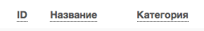

Чтобы отсортировать список нужно просто нажать на название столбца. Первый клик отсортирует список по возрастанию,
второй — по убыванию, дальнейшие клики будут чередовать эти два способа сортировки. При этом сортировка по возрастанию
обозначается стрелкой вверх рядом с наименованием столбца, а сортировка по убыванию — стрелкой вниз.

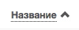

Для некоторых данных используется специальная колонка *Порядок сортировки*.
Она сортирует элементы не только в административном интерфейсе, но и определяет порядок отображения элементов
в интерфейсе на устройстве абонентов. В этой колонке каждому элементу списка соответствует свой значок стрелки.
В зависимости от того, вверх или вниз направлена стрелка, при нажатии на нее элемент уйдет вверх или вниз по списку
соответственно.

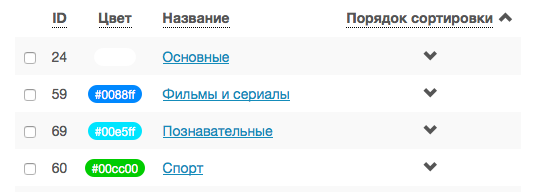

Если список элементов большой, то он разбивается на страницы. На одной странице обычно размещается 25 записей,
но можно выбрать другое значение — 10, 50, 100 или 250, за эту функцию отвечает раскрывающийся список внизу страницы.

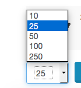

При выборе нового значения текущая страница обновляется, и в зависимости от получившегося количества страниц,
отображается либо та же по счету страница, на которой была произведена смена значений, либо первая ближайшая к ней.
Навигация между страницами осуществляется с помощью навигационной панели с номерами страниц. На панели располагается
10 кнопок с номерами страниц, остальные кнопки позволяют перемещаться между страницами. Так кнопки **<** и **>**
ведут на предыдущую и следующую страницы соответственно. А кнопки **<<** и **>>** загружают первую и последнюю страницы
соответственно.

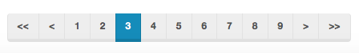

Почти во всех разделах доступен поиск.

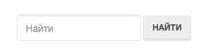

Для разных разделов доступен поиск по разным данным. Практически во всех разделах доступен поиск по ID записи,
поисковый запрос в этом случае должен начинаться с символа ``#``, то есть быть вида ``#ID``.
Для возврата от результатов поиска к полному списку служит кнопка **Сбросить**.

Практически для всех настроек доступно добавление/удаление пунктов. Эту функцию обеспечивают кнопки **Добавить**,
**Изменить** и **Удалить выбранные** над списком.

При этом кнопки **Изменить** и **Удалить выбранные** становятся активными, только после выбора хотя бы одного пункта
списка.

Для удаления сущности достаточно нажать на кнопку **Удалить выбранные**.
После нажатия кнопки **Изменить** открывается страница редактирования, где можно менять значения параметров.

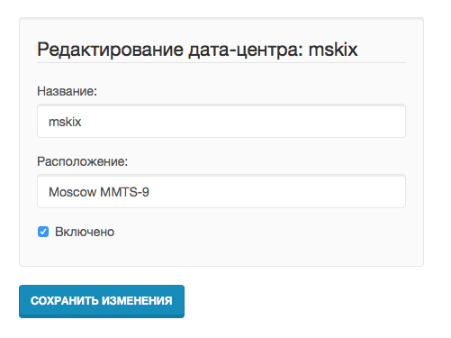

Кнопка **Сохранить изменения** сохраняет внесенные правки. Кнопка **Вернуться к списку** не сохраняя внесенных правок,
просто перемещает пользователя к списку настраиваемых сущностей.

В некоторых разделах доступна сводная статистика активности, например в аккаунтах абонентов.

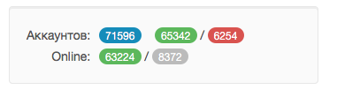

Синим цветом в таких таблицах обозначается общее количество записей. Зеленым обозначается количество записей, у которых
в настройках выбрано: *Активен* или *Включен*, либо их статус *Online*, соответственно красный цвет — количество
записей, у которых не включены значения *Активен* или *Включен*. Серый цвет — количество записей со статусом *Offline*.

.. _smarty-admin-guide-index:

3.2.3. Обзор основных разделов
------------------------------

Панель администора позволяет управлять настройками таких компонентов как:

* Абонентская база
* Тарифные планы и набор услуг
* Телеканалы
* Телепрограмма (EPG)
* Радиостанции
* Каталог видеотеки
* Каталог приложений и игр
* Стриминг-сервисы (Live, VOD, NPVR и др.)
* Устройства просмотра

Для удобства настройки сгруппированы в меню на главной панели и разделены на категории:

* Общие настройки
* Настройки стриминга
* Биллинг
* Настройка услуг
* Абоненты

Чтобы начать работать с настройками следует выбрать необходимый пункт в выпадающем списке интересующей категории.
Каждая настройка представляет собой список, элементы которого можно добавлять/удалять, а так же менять значения их параметров, что позволяет
настраивать различные компоненты.

.. _smarty-admin-guide-main:

3.2.4. Раздел: Общие настройки
------------------------------

.. _smarty-admin-guide-main-device-configuration:

3.2.4.1. Настройки STB и виджетов
~~~~~~~~~~~~~~~~~~~~~~~~~~~~~~~~~

Этот раздел содержит список устройств для просмотра сервиса IPTV (приставки Set-Top Box, Smart TV, мобильные устройства,
компьютер и др.), которые поддерживаются оператором
(см. :ref:`Подключение разрешенных оператору типов устройств<playdevice-assigning-to-client>`).

Здесь указываются базовые настройки для взаимодействия устройств с сервисом.

Для редактирования настроек устройства можно использовать кнопку **Настройки**, либо нажать на название устройства.

На странице настроек можно задать следующие параметры:

Логотип для главного меню
    Изображение с логотипом оператора, которое будет отображаться в главном меню приложения.

Логотип для страницы авторизации
    -//- для страницы авторизации.

Логотип для стартовой страницы
    -//- для страницы загрузки приложения.

Шаблон оформления
    Шаблон оформления абонентского интерфейса. Может быть переопределен настройками аккаунта.

URL на внешний CSS-файл
    Дает возможность задать URL на внешний файл с CSS-стилями если есть необходимость подкорректировать стили
    оформления интерфейса.

Отображать меню '...'
    Позволяет выбрать меню для отображения в интерфейсе, отметив желаемые галочками.

Включить сбор статистических
    Активирует отправку данных телесмотрения с приложения на сервер статистики данных
    (необходима настройка модуля Reports на сервере с MongoDB для хранения данных).

Включить автообновление данных
    Активирует автоматический перезапрос редко обновляемых данных с сервера без без перезагрузки устройства
    перезагрузки устройства. Отключение этой опции повышает производительность.

Текст на странице входа
    Текст приветствия, отображаемый на странице авторизации в приложении.

.. _smarty-admin-guide-main-site-widgets:

3.2.4.2. Виджеты для сайта
~~~~~~~~~~~~~~~~~~~~~~~~~~

В этом разделе настраиваются виджеты для интеграции сайта с сервисом IPTV. Подробнее о механизме
:ref:`встраивания модулей в сайт <widgets-api>`.

Доступны следующие типы виджетов:

* *Channel list* - список телеканалов с группировкой по тарифным планам и возможностью поиска.
* *Registration* - страница регистрации с помощью e-mail и СМС.
* *Account page* - личный кабинет абонента, из которого доступно подключение/отключение тарифных планов, оплата, редактирования профиля и др.
* *EPG program* - телепрограмма на все подключенные телеканалы.

Настройки виджетов:

Тип
    Тип виджета.

Hostname
    URL сайта. Поле используется для защиты виджетов от встранивания в чужой сайт.

URL на внешний CSS-файл
    Адрес файла со стилями виджета. По умолчанию, стили отсутствуют.

Включено
    Флаг, позволяющий включить или отключить определенный виджет.

Для виджета типа *Registration*:

Personal data law URL
    Ссылка на страницу с текстом закона о защите данных абонента.

Public offer URL
    Ссылка на страницу публичной оферты.

Для виджета типа *Account page*:

Relative account page URL
    Ссылка на страницу личного кабинета на сайте оператора, где встраивается виджет. Используется для редиректа.

.. _smarty-admin-guide-main-user-access:

3.2.4.3. Настройка прав пользователей
~~~~~~~~~~~~~~~~~~~~~~~~~~~~~~~~~~~~~

В этом разделе администратору доступно редактирование прав других администраторов или модераторов сервиса
для ограничения их доступа к тем или иным разделам или функциональности.

Добавление новых пользователей производится в служебной панели администрирования по ссылке:
http://smarty.example.com/admin/users/user/.

Права доступа разделены по группам согласно категориям разделов в панели администратора. Детальные права на
выполнение тех или иных действий с данными состоят из:

* *Can view ...* - имеет доступ к просмотру информации
* *Can create ...* - имеет доступ к созданию элементов
* *Can edit ...* - имеет доступ к редактированию
* *Can delete ...* - имеет доступ к удалению

.. _smarty-admin-guide-videostreaming:

3.2.5. Раздел: Настройки стриминга
----------------------------------

.. _smarty-admin-guide-videostreaming-data-centers:

3.2.5.1. Дата-центры
~~~~~~~~~~~~~~~~~~~~

Под дата-центром подразумевается либо физический узел размещения группы серверов, либо виртуальная группа
стриминг-сервисов. Используется для объединения сервисов и дальнейшей маршрутизации на основании предпочтительного
географического либо иного отношения аккаунтов к тем или иным сервисам.

Настройки дата-центра включают в себя:

Название
    Наименование дата-центра, лучше всего писать его служебное имя.

Расположение
    Физическое или виртуальное местоположение дата-центра.

Включено
    Галочка напротив данного пункта указывает на то, что дата-центр используется для предоставления услуг и будет
    участвовать в маршрутизации.

.. _smarty-admin-guide-videostreaming-video-services:

3.2.5.2. Стриминг-сервисы
~~~~~~~~~~~~~~~~~~~~~~~~~

Стриминг-сервисы представляют собой серверы, осуществляющие вещание и обработку видеопотоков.
Набор настроек различается в зависимости от типа выбранного стриминг-сервиса, однако параметры в блоках
*Основные параметры* являются общими для всех.

Название
    Наименование сервиса. Например, имя сервера или конфигурации по ТУ оператора.

Дата-центр
    Дата-центр или группа, к которой относится данный сервис.

Тип
    Тип стриминг-сервиса.

Тип маршрутизации
    Выбор одного из двух типов маршрутизации:

    * Основана на маске URI - при этом способе URL на видеопоток или файл формируется по маске.
    * Python-скрипт - маршрутизация задается скриптом (см. пример далее).

    Под маршрутизацией подразумевается вычисление URL видеопотока, которое происходит в момент обращения устройства
    к соответствующему контенту.

Маска URI / Код скрипта
    Маска URL видеопотока или динамический скрипт. Обратите внимание на возможность применения переменных.

Включено
    Флаг позволяет отключить или включить определенные сервисы из маршрутизации.

IP-адрес сервиса / Порт сервиса / Секретная фраза
    Набор настроек для доступа к API сервиса. Необходимо только при использовании видео-серверов ПО Microimpuls.
    Через API осуществляется настройка сервиса из Middleware, а также авторизация потоков по одноразовым токенам.

Включить управление и авторизацию через API
    Флаг позволяет отключить или включить взаимодействие с сервисом Microimpuls через API.

Включить авторизацию nginx secure_link
    При выборе этой настройки появляется возможность использования дополнительной авторизации ссылок на видеопоток
    с помощью модуля secure_link HTTP-сервера nginx.

Секретная фраза
    Фраза которая будет использована для формирования секретного хэша в ссылке на видеопоток для модуля secure_link.

Время действия
    Время действия в секундах сформированной ссылки доступа к видеопотоку (в некоторых случаях следует указывать время
    равным максимальному непрерывному просмотру потока, например 24 часа (86400)).

Для типа HTTP Streamer:

Сдвиг вещания на
    Время сдвига вещания в часах, в котором вещает сервис. Используется для реализации функции Timeshift - вещание
    эфира со сдвигом для часовых поясов, отличных от часого пояса телеканала. Значение в этом поле используется для
    маршрутизации, в связке с соответствующими настройками аккаунта
    (см. в :ref:`Аккаунты <smarty-admin-guide-customers-accounts>`). Стриминг-сервис для вещания со сдвигом
    конфигурируется отдельно (более подробно читайте в документации соответствующего ПО).

Для типа HTTP Archive Streamer и NPVR:

Сколько дней записывать
    Глубина записи телеканала в днях для сервиса MicroPVR. По прошествию этого количества дней происходит ротация
    записи.

Длительность каждой записи
    Размер одного непрерывного файла записи, в часах. Обычно рекомендуется использовать суточную запись, т.е. 24 часа.

Начинать новую запись в
    Время в сутках, в которое предпочтительно осуществлять разрыв файла записи и начинать новый. Во время разрыва при
    непрерывном просмотре архивной трансляции будет кратковременный обрыв трансляции.

Записывать в директорию
    Абсолютный путь директории на сервере, куда будет осуществляться запись. Поддиректория для конкретного канала
    создается сервисом MicroPVR автоматически.

Тип хранилища
    Тип используемого хранилища для записи определяет приоритет обращения к записям исходя из скорости доступа - так,
    самым быстрым видом хранилища является Memory, затем SSD, затем HDD. Используется для одновременной записи
    наиболее популярных телеканалов на несколько носителей (конфигурируется несколькими стриминг-сервисами). При этом
    возможно определять разную глубину и время записи на разный тип памяти.

Продолжительность жизни записи
    Для сервисов NPVR определяет максимальное время жизни записи в секундах, после прошествия которого она будет
    удалена с сервера и недоступна абоненту.

Для выбора доступны следующие типы потоковых сервисов:

* *Live Unicast* - Unicast-стример Live-потоков. Подходит для HTTP MPEG-TS Streaming, HLS и других Unicast-форматов,
  базирующихся или схожих с протоколом HTTP.
* *PVR Unicast* - Unicast-стример нелинейного ТВ из записи. Подходит для сервисов Catch-Up, например MicroPVR.
* *VOD Unicast* - Unicast-стример фильмов VOD.
* *Live Multicast* - UDP Unicast/Multicast-стример.

3.2.5.2.1. Динамическая и статическая маршрутизация
+++++++++++++++++++++++++++++++++++++++++++++++++++

Если для телеканала, фильма или другой единицы контента заданы активные стриминг-сервисы и не задан прямой URI потока, то
будет использована динамическая маршрутизация. В момент обращения абонентской приставки к соответствующему контенту
осуществляется поиск одного из подключенных стриминг-сервисов на основании типа контента, подключенных тарифных планов,
а также доступности и нагруженности сервиса. Затем, исходя из настроек стриминг-сервиса, формируется URL контента, по
маске либо после вычисления скрипта.

При статической маршрутизации URL контента генерируется при формировании плейлиста. Такой тип маршрутизации может
быть использован для потоков без авторизации, Multicast-потоков для IPTV, либо внешних Unicast-потоков партнеров.

3.2.5.2.2. Динамическая маршрутизация, задаваемая скриптом
++++++++++++++++++++++++++++++++++++++++++++++++++++++++++

Скрипт позволяет создать нестандартную логику маршрутизации. Используемый язык - Python. В результате работы скрипта
должна быть определена переменная ``uri``, содержащая URL видеопотока.

Пример скрипта:
::
    def get_random_proxy(datacenter):
	    if datacenter == 4:
		    proxies = [
			    {
    				'ip': '1.1.1.1', 'port': 8181,
	    			'key': 'DrRSwkrMudmsYb0K'
    			},
	    		{
    				'ip': '2.2.2.2', 'port': 8181,
    				'key': 'DrRSwkrMudmsYb0K'
    			},
    			{
    				'ip': '3.3.3.3', 'port': 8181,
    				'key': 'DrRSwkrMudmsYb0K'
    			}
    		]
    	else:
    		return 0
    	return random.choice(proxies)

    uri = 'http://1.2.3.4:8080/%s/?s=DeZcC2A0OkjLwlBb' % prefix

    proxy = get_random_proxy(adid)
    if proxy:
    	uri = 'http://%s:%d/%s/%s' % (proxy['ip'], proxy['port'], proxy['key'], uri.replace('http://', ''))

Выше приведен пример скрипта, в котором URL видеопотока задается сначала по маске, а затем, если у аккаунта
задан определенный дата-центр (id = 4 в примере), то для него случайным образом выбирается один из прокси-серверов,
после чего URL заменяется на прокси.

.. _smarty-admin-guide-videostreaming-maintenance:

3.2.5.3. Технические работы
~~~~~~~~~~~~~~~~~~~~~~~~~~~

Технические работы используются для частичного ограничения доступа к сервису когда это необходимо.
Например, в заданный временной период, пока проводятся технические работы либо произошла авария, абонентам может быть
недоступен просмотр записанных программ.

В настройках используются данные:

Описание
    Описание технических работ.

Время начала
    Дата и время начала технических работ.

Время окончания
    Дата и время окончания технических работ.

Сервис недоступен
    Флаг делает сервис недоступным для абонентов, если не отметить этот пункт, то вне зависимости от указанного
    времени начала работ сервис не заблокируется.

Работы завершены
    Флаг необходимо отметить после завершения работ, это вернет абонентам доступ к сервису вне зависимости от
    указанного времени окончания работ.

Каналы
    Телеканалы, которые затрагиваются техническими работами (Ctrl + клик левой кнопкой мыши позволяет выбрать
    несколько каналов).

Стриминг-сервисы
    Стриминг-сервисы, которые затрагиваются техническими работами.

.. _smarty-admin-guide-billing:

3.2.6. Раздел: Биллинг
----------------------

.. _smarty-admin-guide-billing-tariffs:

3.2.6.1. Тарифные планы
~~~~~~~~~~~~~~~~~~~~~~~

Раздел позволяет управлять списком тарифных планов и их настройками.
См. :ref:`Возможности тарификации <billing-tariffs-features>`.

Для настройки доступны следующие параметры:

Название
    Наименование тарифного плана.

Тип
    см. :ref:`Типы тарифных планов <billing-tariffs-types>`.

Стоимость
    Размер абонентской платы по тарифу в выбранной валюте.

Валюта
    Выбор валюты тарифного плана.

Мультиабонемент
    Выбор максимального количества одновременных сессий для одного аккаунта, то есть возможность использовать сервис
    IPTV сразу с нескольких устройств, при условии что у всех устройств один и тот же внешний IP-адрес.
    См. :ref:`Описание функции Мультиабонемент <billing-multiabonement>`.

Приоритет тарифа среди базовых тарифов
    См. :ref:`Признак базового тарифа <billing-basic-tariff>`.

Включено
    Флаг для временного отключения или подключения тарифного плана в системе.

Подключаемый по умолчанию
    Тариф с такой пометкой будет автоматически подключаться каждому вновь добавленному абоненту, однако в дальнейшем
    оператор или абонент может самостоятельно отключить его в личном кабинете.

Обязательный
    Тариф, который так же автоматически подключается каждому абоненту, но абонент не может самостоятельно отключить его
    в личном кабинете, использовать эту настройку стоит только в случае наличия одного базового тарифа.

Показывать каналы из тарифа на сайте
    При включении этого флага тарифный план и соответствующие телеканалы будут отображаться в виджете для сайта
    *Channel list* (см. :ref:`Настройка виджетов для сайта <smarty-admin-guide-main-site-widgets>`).

Доступен для неактивных аккаунтов
    См. :ref:`Доступность тарифа для неактивных аккаунтов <billing-debtors-tariffs>`.

Стриминг-сервисы
    Подключение стриминг-сервисов, которые будут доступны абонентам при подключении данного тарифного плана.

Гео-привязка
    При включенном механизме геолокации (см. :ref:`Настройка геолокации <geo-settings>`) позволяет ограничить
    города и страны, в которых данный тарифный план будет доступным. Левый список содержит выбранные страны и города.
    Используйте строку поиска для быстрого выбора.

.. _smarty-admin-guide-billing-documents:

3.2.6.2. Документы
~~~~~~~~~~~~~~~~~~

Документы предназначены для сохранения во встроенном биллинге таких документов как договор, счет, заказ и других.
Договор формируется автоматически при создании нового абонента, счет создается автоматически при списании средств.
На основании созданных договоров и счетов, а также выбранного шаблона можно создавать любые документы, которые будут
привязаны к абоненту. См. :ref:`Настройка маски номера договора и счета <client-creation>`.

Шаблоны создаются в служебной панели администратора по адресу:
http://smarty.example.com/admin/billing/documenttemplate/

Документация по работе шаблонизатора: http://djbook.ru/rel1.7/#the-template-layer

Также доступно прямое редактирование договоров и счетов по адресу:
http://smarty.example.com/admin/billing в соответствующих разделах.

Описание полей:

Название
    Наименование документа.

Шаблон
    Используемый шаблон при генерации документа.

Дата
    Дата создания.

Абонент
    Абонент, для которого создается документ. Поле заполняется с помощью поиска абонента по имени или фамилии.

Договор
    Номер договора, к которому относится документ. Если документ не относится к договору, то это поле можно не указывать.

Счет
    Номер счета, к которому относится документ. Если документ не относится к счету, то это поле можно не указывать.

Генерация созданного документа на основе шаблона производится по иконке со значком "Принтер":

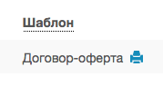

.. _smarty-admin-guide-billing-transactions:

3.2.6.3. Финансовые операции
~~~~~~~~~~~~~~~~~~~~~~~~~~~~

Раздел содержит информацию о движении денежных средств по аккаунтам абонентов.
В списке показаны следующие данные:

ID
    Внутренний идентификатор транзакции.

Ext ID
    Идентификатор транзакции внешней биллинговой или платежной системы.

Абонент
    ФИО абонента.

Источник
    Источник зачисления или списания средств, например, это может быть использованный абонентом способ оплаты при
    использовании встроенного биллинга.

Дата
    Дата операции.

Обработана
    Флаг, означающий подтверждена ли транзакция или нет.

Сумма
    Сумма зачисленная на счет или списанная со счета.

Баланс до
    Баланс счета абонента до подтверждения транзакции.

Баланс после
    Баланс счета абонента после подтверждения транзакции.

Примечание
    Краткое описание операции.

Данные могут добавляться как вручную, так и автоматически в случае использования биллинга
(см. :ref:`Сценарии взаимодействия с биллинговой системой <billing-integration-scenarios>`).
Если используется внешняя система биллинга, то для получения списка транзакций в этом разделе необходима синхронизация
через :ref:`Billing API <billing-api>`.

Поиск здесь представляет собой фильтр, как по одному параметру, так и по нескольким сразу:

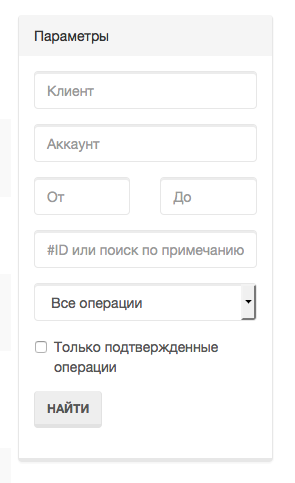

Также доступен экспорт отчета по транзакциям в файл CSV:

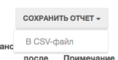

.. _smarty-admin-guide-services:

3.2.7. Раздел: Настройка услуг
------------------------------

.. _smarty-admin-guide-services-categories:

3.2.7.1. ТВ: Категории
~~~~~~~~~~~~~~~~~~~~~~

В этом разделе добавляются категории телеканалов. Каждый телеканал должен обязательно относится к той или иной категории.
В абонентском приложении, в зависимости от шаблона, но как правило, присутствует возможность отображения телеканалов
определенной категории для упрощения поиска нужного контента.
Основные параметры категорий:

Название
    Наименование категории.

Цвет
    Цветовое обозначение категории, которое будет видно в пользовательском интерфейсе абонента.
    Значение можно ввести в виде hex-кода, либо воспользовавшись формой выбора цвета.

Поместить после
    Дает возможность определять порядок вывода категорий в списке на устройстве.
    Так же управление порядком отображения осуществляется на странице со списком категорий, с помощью колонки
    *Порядок сортировки*

.. _smarty-admin-guide-services-channels:

3.2.7.2. ТВ: Каналы
~~~~~~~~~~~~~~~~~~~

Это один из основных разделов для настройки сервиса IPTV/OTT. Здесь производится настройка списка телеканалов,
которые вещает оператор, а также конфигурация их вещания и отображения.

Каналы определяются следующими параметрами:

Название
    Наименование канала. Это название будет видеть абонент.

Программа передач EPG
    Выбор программы передач и иконки для канала, необходимо для отображения EPG и иконки на абонентском устройстве.
    Список доступных каналов EPG настраивается отдельно, см. :ref:`Настройка EPG <epg-setup>`.

Категория
    Выбор категории, к которой относится канал.

Включено
    Показывает статус доступности канала для вещания. При выключении канал не будет отображаться в списке.

Родительский контроль
    Если этот пункт включен, то для просмотра данного канала абоненту потребуется ввести ПИН-код.
    ПИН-код абонента устанавливается в настройках аккаунта.

Тарифные планы
    Позволяет выбрать в каких тарифных планах доступен канал.
    См. :ref:`Возможности тарификации <billing-tariffs-features>`).

Поместить после
    Позволяет указать после какого канала в списке разместить данный канал, используется для управления порядком сортировки.

Стриминг-сервисы
    Определяет через какие стриминг-сервисы будет вещаться канал, а также какие дополнительные стриминг-сервисы для этого
    канала доступны, в зависимости от типа сервиса (например, NPVR, Catch-Up и др.).
    Подробнее про настройку видеостриминга и маршрутизацию
    см. в :ref:`Настройка стриминг-сервисов <smarty-admin-guide-videostreaming-video-services>`.

URL-префикс
    Значение, которое будет передаваться в переменную $prefix при маршрутизации видео
    (используется для генерации URL потока по маске при настройке стриминг-сервиса).

Multicast-адрес
    Этот адрес используется для сервисов записи телеканала, а также если не задан иной адрес потока через маршрутизацию
    с использованием стриминг-сервисов или переопределение URI.

Прямой URI потока
    Позволяет явно задать URI видеопотока данного канала. Если задано, то маршрутизация через стриминг-сервисы
    осуществляться не будет.

Переопределить ID для стриминг-сервисов
    Может понадобиться, если ID канала на используемом стриминг-сервисе отличается от того, который присвоился Middleware.
    Например, с помощью этого поля можно настроить стриминг-сервис MicroPVR от другой копии Middleware, для использования
    общего архивного сервера несколькими операторами.

Примечание
    Текстовый комментарий для сохранения дополнительной информации, нигде не отображается.

Кроме ручного выставления порядка каналов с помощью поля *Порядок сортировки* списку телеканалов можно автоматически
задать сортировку, которая будет использоваться на устройствах пользователей, используя методы из списка
**Авто-сортировка**, который расположен выше остальных кнопок управления:

Автоматически
    Сортировка осуществляется по номерам кнопок каналов, которые задаются в поле *Номер для сортировки* при настройке
    EPG-каналов, см. :ref:`Настройка EPG <epg-setup>`. При использовании Microimpuls Middleware как платформы от
    ООО "Майкроимпульс" в рамках услуги "Виртуальный оператор" данный метод отсортирует каналы согласно заключенным
    лицензионным договорам между ООО "Майкроимпульс" и правообладателями и действующему законодательству.

По ID
    При добавлении канала в список ему присваивается ID, данная сортировка происходит по этому параметру.

По названию
    Сортировка осуществляется по наименованию канала.

Пользовательская сортировка
    Если была применена одна из предыдущих сортировок, выбор этого пункта вернет к первоначальной ручной сортировке
    оператора.

.. _smarty-admin-guide-services-epg:

3.2.7.3. ТВ: Телепрограмма
~~~~~~~~~~~~~~~~~~~~~~~~~~

Раздел позволяет просматривать EPG для всех каналов, а также очищать и принудительно переимпортировать EPG для
отдельных каналов.

Выбор канала осуществляется в левом меню. Для очистки телепрограммы необходимо нажать кнопку **Очистить EPG**, для
импортирования - **Принудительно импортировать EPG**.

.. note::

    Автоматический импорт настраивается через планировщик,
    см. :ref:`Настройка выполнения команд в crontab <crontab-settings>`.

    Расширенное редактирование EPG доступно в служебной панели администратора,
    см. :ref:`Редактирование EPG в ручном режиме <manual-epg-editing>`.

.. _smarty-admin-guide-services-genres:

3.2.7.4. Видеотека: Жанры
~~~~~~~~~~~~~~~~~~~~~~~~~

В этом разделе можно добавлять/удалять и редактировать жанры для фильмов, предоставляемых по услуге Video-On-Demand.
У жанров есть два параметра:

Название
    Наименование жанра.

Поместить после
    Позволяет управлять сортировкой жанров.

Жанры отображаются в пользовательском интерфейсе на абонентских устройствах, при выборе пункта меню,
соответствующего данной услуге. Так же для определения порядка, в котором жанры выводятся на устройстве
абонента, используется колонка *Порядок сортировки*.

.. _smarty-admin-guide-services-videos:

3.2.7.5. Видеотека: Фильмы
~~~~~~~~~~~~~~~~~~~~~~~~~~

В этом разделе осуществляется управление каталогом фильмов и видео-файлов.
Фильмы определяются следующими параметрами:

Название
    Название видео.

Жанры
    Жанры, к которым относится видео, необходимо отметить галочками, после чего происходит привязка видео к жанрам.

Тарифные планы
    Видео будет доступно на выбранных в этом пункте тарифах.

Стриминг-сервисы
    Позволяет выбрать, на каких видео-серверах размещены файлы данного видео.

Прямой URI потока
    Позволяет явно задать адрес потока, при этом имя файла подставляется к концу заданного адреса.
    Если задано, то маршрутизация через стриминг-сервисы осуществляться не будет.

ID на кинопоиске
    ID фильма на сайте www.kinopoisk.ru, обратите внимание на кнопку **Загрузить с кинопоиска**, которая позволяет
    автоматически загрузить с сайта такие данные о видео как *Описание*, *Год выпуска*, *Адрес превью*, *Актеры*,
    *Страна*, *Режиссер*.

Оригинальное название
    Название видео на языке страны-производителя.

Описание
    Краткое описание видео.

Год выпуска
    Год выхода видео.

Адрес превью
    Ссылка на внешний файл с изображением для видео, которое будет показываться в меню абонента в списке видеотеки.

Актеры
    Список актеров.

Страна
    Страна или страны, принимавшие участие в создании видео.

Режиссер
    Имя режиссера.

В списке фильмов есть кнопка **Assets**, при нажатии на которую будет открыт
раздел редактирования ассетов (файлов), относящихся к данному видео. У одного видео может быть несколько ассетов, выбор конкретного
ассета для воспроизведения доступен абоненту при просмотре информации о фильме на своем устройстве.

Поля, которые необходимо заполнить при добавлении ассета и можно менять при его редактировании:

Название
    Наименование ассета.

Имя файла
    Имя файла на сервере VOD.

Длительность
    Длительность видео в минутах. Необходимо для правильного расчета длительности просмотра видео и функции перемотки
    для устройств, не поддерживающих автоматическое определение длительности.

Обратите внимание, что для того чтобы вернуться к изначальному списку ассетов видеотеки, следует нажать кнопку
**Вернуться к списку**, которая расположена над списком.

.. _smarty-admin-guide-services-radios:

3.2.7.6. Радиостанции
~~~~~~~~~~~~~~~~~~~~~

В этом разделе осуществляется редактирование списка радиостанций. Радиостанция описывается полями:

Название
    Наименование радиостанции.

Прямой URI потока
    Адрес потока Multicast либо Unicast-адрес интернет-радиостанции. Маршрутизация осуществляется статически, без
    задействования стриминг-сервисов.

Включено
    Флаг, позволяющий временно отключить радиостанцию в сервисе.

Тарифные планы
    Радиостанция будет доступна в отмечененных тарифных планах.

.. _smarty-admin-guide-services-ads:

3.2.7.7. Рекламные ролики
~~~~~~~~~~~~~~~~~~~~~~~~~

В этом разделе добавляются рекламные ролики, которые затем могут быть сформированы в *Рекламные блоки* (см. далее).
Рекламный ролик определяется следующими параметрами:

Название
    Наименование ролика.

Прямой URI потока
    Адрес потока Multicast либо Unicast-адрес, по которому транслируется ролик. Маршрутизация осуществляется статически,
    без задействования стриминг-сервисов.

Стриминг-сервисы
    Необходимо отметить те стриминг-сервисы, при просмотре контента с которых абоненту может быть показан данный ролик.
    Например, это может быть Multicast стриминг-сервис или PVR, тогда при просмотре соответствующего контента при наличии
    рекламного блока будут показаны ролики, ассоциированные с этим же стриминг-сервисом.

.. note::

    Поддержка данного функционала возможна не на всех устройствах и её реализация зависит от абонентского приложения.

.. _smarty-admin-guide-services-ad-blocks:

3.2.7.8. Рекламные блоки
~~~~~~~~~~~~~~~~~~~~~~~~

В этом разделе добавляются рекламные блоки, состоящие из последовательности роликов. Рекламный блок определяется
следующими параметрами:

Дни показа
    Дни недели, в которые рекламный блок может быть показан.

Время начала / окончания
    Промежуток времени в формате ЧЧ:ММ:СС, в который может быть показан рекламный блок.

Непрерываемое время рекламного блока
    Время в секундах, после которого абонент сможет пропустить рекламный блок.

Рекламные ролики
    Необходимо выбрать рекламные ролики, входящий в данный блок.

Каналы
    Необходимо выбрать телеканалы, при просмотре которых в разных типах сервиса возможен показ рекламного блока.

Тарифные планы
    Необходимо выбрать тарифные планы, на которых рекламный блок будет показываться. Возможно создать специальные
    тарифные планы, не содержащие рекламные блоки.

.. _smarty-admin-guide-services-apps:

3.2.7.9. Каталог приложений
~~~~~~~~~~~~~~~~~~~~~~~~~~~

В данном разделе производится управление каталогом внешних приложений, доступных на абонентском устройстве в портале,
кроме основного сервиса IPTV. Внешним приложение может быть, например, плеер Youtube, онлайн-чат, служба прогноза погоды
или пробок, игры и другие сервисы. Приложение представляет собой Web-страницу на Javascript.

Приложение содержит следующие параметры:

Название
    Название приложения, будет отображено на иконке в абонентском интерфейсе.

Системное название
    Системное название задействуется в имени CSS-класса для иконки и экрана, в котором загружается приложение, а также
    как внутренний идентификатор экрана в портале.

Тип
    Доступны следующие типы приложений:

    * Web-приложение во внешнем окне - при открытии приложения пользователь будет переадресован на внешний URL,
      Javascript-окружение портала будет недоступно. В качестве *URL приложения* задается адрес URL.
    * Web-приложение во внутреннем окне - приложение будет открыто в рамках используемого портала, без перезагрузки
      страницы, при этом доступно всё окружение и текущий контекст. В качестве *URL приложения* задается имя класса
      главного экрана приложения.
    * Ссылка на раздел видеотеки - при открытии приложения пользователь будет перемещен в раздел VOD, при этом будет
      выбрана конкретная категория. В качестве *URL приложения* указывается ID категории видео.
    * Воспроизведение потока по ссылке - приложение представляет собой простой плеер потока в полноэкранном режиме.
      В качестве *URL приложения* задается адрес потока.

CSS для кнопки
    CSS-стиль, который будет добавлен к стилю иконки в портале.

Включено
    Позволяет временно отключить приложение в сервисе.

Показывать приложение в главном меню
    При включении данной опции приложение будет показано в главном меню портала, в противном случае оно будет доступно
    в специальном разделе *"Сервисы"* или *"Приложения"* (в зависимости от используемого шаблона портала).

Доступно на устройствах
    Необходимо отметить типы устройств, для которых разработано данное приложение.

.. note::

    При разработке собственного внешнего приложения будет полезна документация разработчика по движку абонентского
    портала Justify, которая доступна по адресу: http://mi-justify-dev-docs.readthedocs.io/

.. _smarty-admin-guide-services-games:

3.2.7.10. Каталог игр
~~~~~~~~~~~~~~~~~~~~~

В этом разделе осуществляется подключение встроенных в абонентский портал игр. Поскольку такие игры
технически являются частью портала и не могут быть представлены так, как внешние приложения, то их создание и
редактирование производится в служебной панели администратора по адресу:
http://smarty.example.com/admin/tvmiddleware/game/

Описание полей:

Client IDs
    Необходимо выбрать операторов, для которых будет доступна игра.

Название
    Название игры, будет отображено на иконке запуска игры.

Системное название
    Системное имя игры, соответствующее имени директории, в которой располагается код игры. Является частью порталов.

.. _smarty-admin-guide-customers:

3.2.8. Раздел: Абоненты
-----------------------

.. _smarty-admin-guide-customers-customers:

3.2.8.1. Абоненты
~~~~~~~~~~~~~~~~~

В данном разделе производится заведение абонентов. В списке абонентов есть три специальные колонки:
*Аккаунты*, *Платежи* и *Сообщения* - они содержат ссылки на соответствующие связанные с абонентом разделы.

При нажатии на имя абонента открывается карточка абонента и страница редактирования его параметров. На этой странице
особый интерес представляет следующая информация:

Аккаунты абонента
    Список аккаунтов абонента, где отображены основные данные: *Абонемент*, *Последняя активность*, *Устройство*.

Финансовая информация
    Показывает такие данные как: *Состояние счета* (доступная сумма денежных средств на счете), *Ежемесячный платёж*,
    *Ежегодный платёж* и последние пять операций связанных со счетом абонентам (зачисление/списание средств).
    Просмотреть более поздние операции по счету можно нажав кнопку **Все платежи абонента**.

Документы
    Позволяет редактировать номер договора и просматривать список документов, ассоциированных с данным абонентом.
    См. :ref:`Документы <smarty-admin-guide-billing-documents>`.

Зарегистрированные устройства
    Содержит информацию о подключенных устройствах абонента, а именно: *Название*, *Device UID*
    (уникальный идентификатор устройства), *Добавлено* (дата добавления устройства в систему).

Тарифные планы
    Список тарифных планов, подключенных абоненту. Набор услуг, доступных абоненту, будет сформирован исходя из
    подключенных тарифных планов и входящих в их состав услуг, стриминг-сервисов и опций.

Привязан к дилеру
    Здесь можно указать через какого дилера был подключен абонент,
    см. :ref:`Дилеры <smarty-admin-guide-customers-dealers>`.

Примечание
    Заметки и дополнительная информация об абоненте.

Все остальные поля представляют собой персональные данные абонента.

.. _smarty-admin-guide-customers-accounts:

3.2.8.2. Аккаунты
~~~~~~~~~~~~~~~~~

В этом разделе производится заведение аккаунтов абонентов. При нажатии на номер аккаунта открывается карточка аккаунта,
где также доступно редактирование его параметров.
Рассмотрим данные на странице с карточкой аккаунта:

Абонемент
    Номер аккаунта или логин.

Пароль
    Пароль абонента для данного аккаунта. Есть возможность сгенерировать новый пароль в случае необходимости.
    С помощью абонемента и пароля абонент авторизуется в интерфейсе пользователя на своем устройстве при первом
    запуске.

    .. note::

        Некоторые устройства поддерживает пароль не только из цифр, но и из латинских букв, однако для удобства ввода
        пароля с пульта рекомендуется использовать цифровые пароли.

ПИН-код
    Код, необходимый для доступа к каналам, закрытым родительским контролем.

Дата активации / деактивации
    Дата, когда аккаунт должен быть активирован/деактивирован встроенным биллингом.
    См. подробнее в разделе :ref:`Встроенный биллинг <builtin-billing>`.

Активация после первого входа
    Количество дней, на которое аккаунт будет автоматически продлен после первого входа в сервис.
    Можно использовать для предоставления ознакомительного периода, в этом случае после первой авторизации сразу
    расчитывается дата деактивации аккаунта. Если же ознакомительного периода нет, то поле должно оставаться пустым.

Абонент
    Абонент, к которому относится аккаунт. Заполняется через ввод ФИО абонента.

Дата-центр
    Позволяет привязать обслуживание аккаунта к конкретному дата-центру. Если задано, то при маршрутизации стриминг-сервисов
    при образении абонента к контенту в первую очередь будут выбираться стриминг-сервисы, относящиеся к данному дата-центру.

Шаблон оформления
    Шаблон для оформления абонентского интерфейса. См. :ref:`Добавление шаблонов порталов <playdevice-template-creation>`.

Активен
    Отмеченная галочка означает, что аккаунт доступен абоненту для использования.

Разрешить мультилогин на всех устройствах
    Позволяет абоненту использовать аккаунт на неограниченном количестве устройств для подключения к сервису IPTV,
    при этом все устройства могут иметь разные внешние IP-адреса. Переопределяет опцию *Мультиабонемент* на тарифном плане.

Разрешить авторизацию только по абонементу
    Допускает авторизацию аккаунта без использования пароля. При задействовании такого режима авторизации в качестве
    абонемента аккаунта может быть использован лицевой счет абонента в биллинговой системе оператора. Также, в этом случае
    при авторизации проверяется существование и привязка UID (или MAC-адреса) устройства к аккаунту.

Разрешить авторизацию только по UID устройства
    Допускает авторизацию только по UID устройства, при этом устройство с данным UID должно быть привязано к аккаунту.
    В этом случае не используется ни абонемент, ни пароль аккаунта. Такой способ авторизации может быть удобен в том
    числе и при миграции абонентской базы с другой платформы в случае, если нет возможности восстановить пароли аккаунтов.

Включить просмотр Live со сдвигом
    Опция используется для сервиса вещания Live-потоков со сдвигом. Если включено, то при маршрутизации стриминг-сервисов
    при воспроизведении контента будут в первую очередь выбираться стриминг-сервисы, значение параметра *Сдвиг вещания*
    которых наиболее близок к часовому сдвигу абонента.

Предпочитаемый сдвиг по времени
    Сдвиг часового пояса абонента, относительно GMT+0.

Информация об аккаунте
    Представляет собой сводку основной информации по данному аккаунту.

Зарегистрированные устройства
    Информация об устройствах абонента, которые привязаны к данному аккаунту.

.. _smarty-admin-guide-customers-devices:

3.2.8.3. Устройства
~~~~~~~~~~~~~~~~~~~

В этом разделе отображается список зарегистрированных устройств абонентов. Информация об устройствах добавляется
в систему автоматически, при первом подключении абонента, но также допускается и ручное добавление устройств.
Устройство определяется следующими параметрами:

Устройство просмотра
    Тип устройства, см. :ref:`Добавление поддерживаемых устройств <playdevice-creation>`.

Device UID
    Уникальный идентификатор устройства абонента, часто MAC-адрес.

Аккаунт
    Аккаунт, к которому привязано устройство.

.. _smarty-admin-guide-customers-messages:

3.2.8.4. Сообщения
~~~~~~~~~~~~~~~~~~

В этом разделе можно создавать информационные рассылки на устройства абонентов. Такие сообщения могут быть добавлены
как вручную из интерфейса личного кабинета, так и добавляются системой автоматически, например при поступлении платежа
из личного кабинета, или подключении/отключении тарифного плана, или при приближающейся дате окончания подписки.

.. note::
    В большинстве абонентских приложений Microimpuls входящие сообщения реализованы как всплывающие окна.

Для добавления сообщения вручную нужно заполнить поля:

Тема
    Тема сообщения.

Текст сообщения
    Текст с необходимым форматированием в HTML.

    .. warning::
        Мобильные и нативные приложения могут не поддерживать HTML-форматирование.

Аккаунт
    Аккаунт, на который необходимо отправить сообщение. Необходимо указать номер абонемента.

.. _smarty-admin-guide-customers-messages-mass-mailing:

3.2.8.4.1. Массовая рассылка сообщений
++++++++++++++++++++++++++++++++++++++

Инструмент **Массовая рассылка** позволяет сформировать рассылку сообщений группе абонентов, которую можно выбрать
по нескольким критериям:

* Период последней активности аккаунтов - позволяет выбрать абонентов, которые использовали сервис в определенный
  период.
* Тарифные планы - позволяет выбрать тарифные планы, в этом случае в выборку попадут абоненты, которым подключены
  выбранные тарифные планы.

При использовании массовой рассылки в теме и тексте сообщения можно использовать переменные, которые будут автоматически
заменены на значения в момент создания сообщения: ``$firstname`` - имя абонента, ``$lastname`` - фамилия абонента.

.. _smarty-admin-guide-customers-dealers:

3.2.8.5. Дилеры
~~~~~~~~~~~~~~~

Дилеры — это партнеры, которые могут предоставлять услуги и взаимодействовать с абонентами от имени оператора.
В этом разделе указывается информация о дилерах, набор полей и структура раздела схожа со страницей
:ref:`Абоненты <smarty-admin-guide-customers-customers>`.

Отдельно стоить обратить внимание на поля *Имя пользователя* и *Пароль* - эти данные нужны для создания учетной записи
дилера в панели администрирования Smarty. Такая учетная запись имеет ограниченные права и не имеет доступа к некоторым
возможностям, однако позволяет создавать абонентов и аккаунтов, таким образом подключая их к сервису.

Созданные абоненты и аккаунты автоматически привязываются к дилеру.

.. _smarty-admin-guide-customers-utils:

3.2.8.6. Вспомогательные инструменты
~~~~~~~~~~~~~~~~~~~~~~~~~~~~~~~~~~~~

Массовая установка аккаунтам дата-центра
    Этот инструмент позволяет установить определенный дата-центр всем аккаунтам. В некоторых конфигурациях сервиса
    это может быть полезно для переброса всех абонентов на резервный дата-центр.

.. _billing-general-points:

3.3. Общие особенности работы с услугами и аккаунтами в Smarty
==============================================================

.. _billing-tariffs-features:

3.3.1. Возможности тарификации
------------------------------

Тарифный план представляет собой группу объединенных в него услуг, например телеканалов, интерактивных функций,
фильмов и т.д.

Набор подключенных тарифных планов у абонента и аккаунта определяет набор доступных для него услуг,
при этом возможно пересечение услуг в разных тарифных планах.

Тарифный план может не содержать ни одной услуг, однако обладать определенными опциями и разрешениями,
в таком случае тарифный план считается тарифной опцией.

.. _billing-tariffs-types:

3.3.2. Типы тарифных планов
---------------------------

1. Помесячная оплата - тарифный план рассчитывается биллингом в рамках ежемесячной подписки.

2. Ежегодная оплата - во встроенном биллинге не реализовано.

3. Скрытый - тарифный план не участвует в расчетах и невидим для абонента.

.. _billing-multiabonement:

3.3.3. Мультиабонемент
----------------------

Для тарифного плана возможно включить опцию *Мультиабонемент*, указав количество возможных одновременных сессий.
Среди подключенных у абонента тарифных планов с опцией *Мультиабонемент* будет выбран тот, где число одновременных сессий максимально,
и именно такое количество сессий будет разрешено для одновременного использования абонентом на разных устройствах,
однако в пределах одного IP-адреса (используется для пакетов типа "Семейный").

.. _billing-basic-tariff:

3.3.4. Признак базового тарифа
------------------------------

Поле *"Приоритет тарифа среди базовых тарифов"* означает принадлежность тарифа к Базовому и его вес среди них.
Например, может быть создано несколько базовых тарифов, при этом тариф с наибольшим приоритетом будет устанавливаться абонентам по умолчанию.

Абонент может выбрать только один из базовых тарифов при регистрации и в личном кабинете.

Тариф, не являющийся базовым, считается дополнительным.
Дополнительные тарифы могут быть подключены только дополнительно к одному из базовых, и не могут быть подключены отдельно от него.

.. _billing-debtors-tariffs:

3.3.5. Доступность тарифа для неактивных аккаунтов
--------------------------------------------------

Специальная опция тарифа *"доступен для неактивных аккаунтов"* позволяет создать тарифные планы с набором бесплатных услуг,
доступных абонентам, которые были отключены по причине неоплаты, или другой причине.

Таким образом, можно создать набор телеканалов или дополнительных сервисов, которые будут доступны неактивным абонентам.

Для аккаунтов, у абонентов которых есть подключенные тарифные планы с такой опцией,
разрешается авторизация в системе даже будучи неактивными, однако им выдается ограниченный данными тарифными планами набор услуг.

Это может быть использовано, например, для бесплатной трансляции каналов 1 и 2 мультиплекса.

.. _builtin-billing:

3.4. Выбор модели работы с внешней или встроенной биллинговой системой
======================================================================

3.4.1. Описание режимов работы биллинга
---------------------------------------

.. _billing-activation-deactivation-dates-mode:

3.4.1.A. Встроенный биллинг по датам активации и деактивации (предоплатная модель)
~~~~~~~~~~~~~~~~~~~~~~~~~~~~~~~~~~~~~~~~~~~~~~~~~~~~~~~~~~~~~~~~~~~~~~~~~~~~~~~~~~

Для каждого аккаунта может быть задана дата активации и дата деактивации. Когда наступает дата активации
аккаунт автоматически активируется и может быть авторизован в системе и получить доступ к просмотру.
Когда наступает дата деактивации, аккаунт деактивируется. Биллинг самостоятельно не устанавливает эти даты,
поэтому такой вариант биллинга является ручным или полуавтоматическим.

Варианты использования:

1. Даты устанавливаются администратором / оператором абонентского отдела
2. Даты устанавливаются внешней биллинговой системой через :ref:`Billing API <billing-api>`
3. Для предоставления первичного доступа к сервису после регистрации, или раздачи тестовых аккаунтов.
   В таком случае используется специальное поле *"количество дней активации"*, которое предустанавливается для нового аккаунта.
   Если это поле задано, то после первой авторизации такого аккаунта (разрешается авторизоваться неактивным аккаунтом)
   он сразу активируется, при этом устанавливается дата активации (текущая дата) и дата деактивации (дата активации + число дней тестового доступа).
   Затем по наступлении даты деактивации аккаунт отключается, как описано выше.

.. _billing-auto-mode:

3.4.1.B. Встроенный биллинг: автоматический (предоплатная модель)
~~~~~~~~~~~~~~~~~~~~~~~~~~~~~~~~~~~~~~~~~~~~~~~~~~~~~~~~~~~~~~~~~

1. Ежемесячная подписка.
   Логика работы повторяет режим I, кроме следующих исключений:
   а) в момент наступления даты деактивации происходит попытка списания средств и продления аккаунта, а также устанавливается дата продления, равная текущей дате;
   б) если наступает дата, равная дате последнего продления + календарный месяц, то происходит попытка списания средств и продления аккаунта.
2. Ежегодная подписка - не реализовано во встроенном биллинге, требуется использование внешнего биллинга.
3. Другое (система скидок, платежи за несколько месяцев) - не реализовано во встроенном биллинге, требуется использование внешнего биллинга.

.. _billing-charging-mechanism:

3.4.1.B.1. Механизм списания средств и продления
++++++++++++++++++++++++++++++++++++++++++++++++

Если на счете абонента есть необходимая сумма денег для оплаты всех подключенных тарифных пакетов и опций на очередной месяц,
то происходит списание этих средств и аккаунт не деактивируется.
Устанавливается дата продления, равная текущей дате (необходима для расчета следующего списания).

Если средств недостаточно, то аккаунт деактивируется.
В момент списания средств создается транзакция с отрицательной суммой операции.

.. _billing-payment-mechanism:

3.4.1.B.2. Механизм оплаты
++++++++++++++++++++++++++

Оплата возможна через ручное создание транзакции в биллинге, через внешний биллинг,
через оплату в личном кабинете (оплата разными способами через шлюз WalletOne, оплата кредитной картой, Paypal).
После подтверждения транзакции если аккаунт абонента неактивен, то происходит попытка списания средств и продления аккаунта,
а если он активен - то простое зачисления средств на личный счет в системе.
В момент оплаты создается транзакция с положительной суммой операции.

.. _billing-disabled-mode:

3.4.1.C. Встроенный биллинг отключен, использование внешнего биллинга
~~~~~~~~~~~~~~~~~~~~~~~~~~~~~~~~~~~~~~~~~~~~~~~~~~~~~~~~~~~~~~~~~~~~~

Если не установлена ни дата активации, ни дата деактивации, ни дата продления (не используется ни режим A, ни B),
то биллинг для аккаунта считается отключенным.
Такой аккаунт может быть постоянно активированным, или управляться внешней биллинговой системой без задействования встроенного биллинга.
См. :ref:`Варианты взаимодействия с внешней биллинговой системой <billing-integration-scenarios>`.

